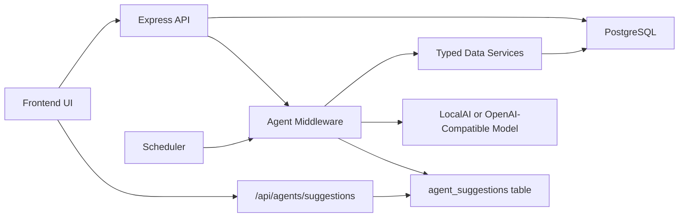

# Agent Services Middleware Design

Generated: 2026-05-30

This document proposes a lightweight agent-services layer for KeepTally. The goal is to provide smart operational suggestions, reporting, and housekeeping without slowing down the main application or giving AI direct, unrestricted database access.

## Core Idea

Add a small service layer between the frontend, API, database, and AI model.

These services would run as scheduled jobs, event-driven jobs, or manually triggered checks. They would analyze narrow slices of data and write concise recommendations back into the application.

The AI should not directly query the database. Instead, it should receive curated summaries from trusted services and return structured recommendations.

## Proposed Architecture



## Recommended Pattern

Use small, typed workers with strict inputs and outputs.

Example agent contract:

```ts
type AgentJob = {
  id: string;
  name: string;
  schedule: "hourly" | "daily" | "weekly" | "monthly" | "manual";
  run(context: AgentContext): Promise<AgentResult>;
};
```

Example result:

```ts
type AgentSuggestion = {
  accountId: number;
  locationId?: number;
  severity: "info" | "warning" | "critical";
  category: "inventory" | "warehouse" | "users" | "reports" | "maintenance";
  title: string;
  summary: string;
  recommendedAction?: string;
  source: string;
  confidence?: number;
};
```

## Suggested Agent Services

### 1. Inventory Health Agent

Schedule:

- Hourly or daily.

Purpose:

- Find out-of-stock items.
- Find items below par.
- Find items with no barcode.
- Find duplicate names/barcodes within a location.
- Find items that have not been updated recently.

Output examples:

- “Route 3 has 18 items below par.”
- “7 items have no barcode and may slow down scanner workflows.”
- “Coke Zero appears twice in Carvana North with similar names.”

### 2. Warehouse Reorder Agent

Schedule:

- Daily or weekly.

Purpose:

- Review warehouse quantities, reorder points, and recent purchase history.
- Recommend purchases.
- Flag missing cost information.

Output examples:

- “Pepsi Zero 20oz is below reorder point in Mesa Warehouse.”
- “14 warehouse items have no case cost.”

### 3. Route Readiness Agent

Schedule:

- Daily before route activity.

Purpose:

- Look at route sheets, store inventory, and below-par items.
- Suggest what should be staged before a route.

Output examples:

- “Carvana South has 22 low-stock items for tomorrow’s route.”
- “Route sheet has stops but no restock items yet.”

### 4. User Access Review Agent

Schedule:

- Weekly or monthly.

Purpose:

- Review inactive users.
- Find users without account memberships.
- Find users with assigned location names that are not normalized.
- Flag admin users for review.

Output examples:

- “2 active users have no normalized location assignments.”
- “Admin access should be reviewed for 3 users.”

### 5. Data Quality Agent

Schedule:

- Daily or weekly.

Purpose:

- Run database-health checks similar to preflight.
- Detect negative quantities, orphan references, duplicate item names, duplicate barcodes, and missing normalized location references.

Output examples:

- “No relational health issues found.”
- “4 scan log rows reference missing items.”

### 6. AI Workflow Coach

Schedule:

- Manual, daily, or after heavy voice usage.

Purpose:

- Summarize voice-command failures, ambiguous item matches, and fallback usage.
- Recommend better barcodes, aliases, or naming cleanup.

Output examples:

- “Voice mode had 9 ambiguous matches for Coke products.”
- “Add aliases for M&M’s and M and Ms to reduce correction prompts.”

### 7. Executive Summary Agent

Schedule:

- Daily, weekly, or monthly.

Purpose:

- Create a plain-language operations summary.

Output examples:

- “Weekly summary: 600 items tracked, 41 below par, 12 out of stock, 3 users active, no database integrity warnings.”

## Database Additions

Add a table to store suggestions and summaries:

```sql
create table agent_suggestions (
  id serial primary key,
  account_id integer not null references accounts(id) on delete cascade,
  location_id integer references locations(id) on delete set null,
  category text not null,
  severity text not null default 'info',
  title text not null,
  summary text not null,
  recommended_action text,
  source text not null,
  confidence real,
  status text not null default 'open',
  created_at timestamp with time zone not null default now(),
  resolved_at timestamp with time zone,
  resolved_by_user_id integer references users(id) on delete set null
);

create index agent_suggestions_account_status_created_idx
  on agent_suggestions (account_id, status, created_at);

create index agent_suggestions_account_location_created_idx
  on agent_suggestions (account_id, location_id, created_at);
```

Optional future table:

```sql
create table agent_runs (
  id serial primary key,
  account_id integer references accounts(id) on delete cascade,
  agent_key text not null,
  status text not null,
  started_at timestamp with time zone not null default now(),
  finished_at timestamp with time zone,
  elapsed_ms integer,
  error text
);
```

## API Additions

Recommended endpoints:

| Endpoint | Purpose |
| --- | --- |
| `GET /api/agents/suggestions` | List open/resolved suggestions |
| `POST /api/agents/suggestions/:id/resolve` | Resolve a suggestion |
| `POST /api/agents/run/:agentKey` | Manually run one agent |
| `GET /api/agents/runs` | View recent agent runs |
| `GET /api/agents/status` | View scheduler and agent health |

Permissions:

- View suggestions: authenticated users.
- Resolve suggestions: admin or relevant permission.
- Run agents manually: admin.
- View agent runs: admin.

## Scheduling Options

### Option A: In-Process Scheduler

Use a Node scheduler inside the API container.

Pros:

- Simple.
- No extra container.
- Good for VPS testing.

Cons:

- Jobs stop if API restarts.
- Must avoid duplicate jobs if multiple API containers run later.

Good for current VPS test phase.

### Option B: Separate Worker Container

Run `keeptally-worker` beside the API container.

Pros:

- Cleaner separation.
- Jobs do not block API requests.
- Easier to scale later.

Cons:

- More Docker configuration.
- Requires job health checks.

Best long-term direction.

### Option C: System Cron Calling API

Use OS-level cron to call internal endpoints.

Pros:

- Very simple.
- Easy to schedule hourly/daily/monthly.

Cons:

- Less portable.
- Harder to observe job status unless runs are logged.

Good as a temporary bridge.

## Performance Rules

To keep this fast:

- Agents should use indexed queries only.
- Agents should process by account and location, not whole-database scans.
- Jobs should have timeouts.
- Jobs should store compact suggestions, not huge reports.
- AI calls should be optional and used only after deterministic database checks.
- Repeated summaries should use cached or pre-aggregated data.

Target timings:

| Agent Job | Target |
| --- | --- |
| Inventory health | under 1 second for 600-5,000 items |
| Data quality | under 1 second for test DB |
| User access review | under 500ms |
| Executive summary without AI | under 1 second |
| Executive summary with local AI | depends on model, but database work should stay under 1 second |

## AI Usage Guidance

Use deterministic SQL first. Use AI second.

Good AI inputs:

- Counts.
- Top 10 issues.
- Current account/location.
- Recent activity summary.

Bad AI inputs:

- Full item tables.
- Full history logs.
- Password/user-security fields.
- Raw SQL access.

Good AI task:

```text
Summarize these inventory issues into three short operational recommendations.
```

Bad AI task:

```text
Look through the whole database and tell me what is wrong.
```

## Frontend Placement

Recommended UI surfaces:

- Dashboard: “Smart Suggestions” panel.
- Inventory page: location-specific suggestions.
- Warehouse page: reorder and cost suggestions.
- Admin page: access/security suggestions.
- Settings page: agent schedule configuration.

Keep suggestions actionable:

- Title.
- Severity.
- One-sentence summary.
- Recommended action.
- Resolve/dismiss button.

## Implementation Phases

### Phase A: Deterministic Suggestions

Build without AI first:

- `agent_suggestions` table.
- Inventory health agent.
- Data quality agent.
- User access review agent.
- Manual run endpoint.
- Dashboard suggestions panel.

### Phase B: Scheduler

Add scheduling:

- Hourly inventory health.
- Daily data quality.
- Weekly access review.
- Manual run for admin.

### Phase C: AI Summaries

Add model-assisted summaries:

- Feed compact deterministic findings to LocalAI/OpenAI-compatible endpoint.
- Store AI-generated summaries as suggestions.
- Track confidence/source.

### Phase D: Worker Container

Move jobs into a separate worker container when the test environment grows.

## Recommendation

Start with Phase A. Keep the first version deterministic and fast. Once the app reliably produces useful suggestions, add AI summaries on top of those findings.

This approach gives KeepTally a smart operational layer without making the model responsible for database correctness or application control.
