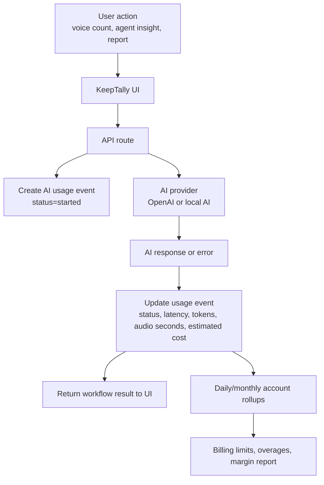
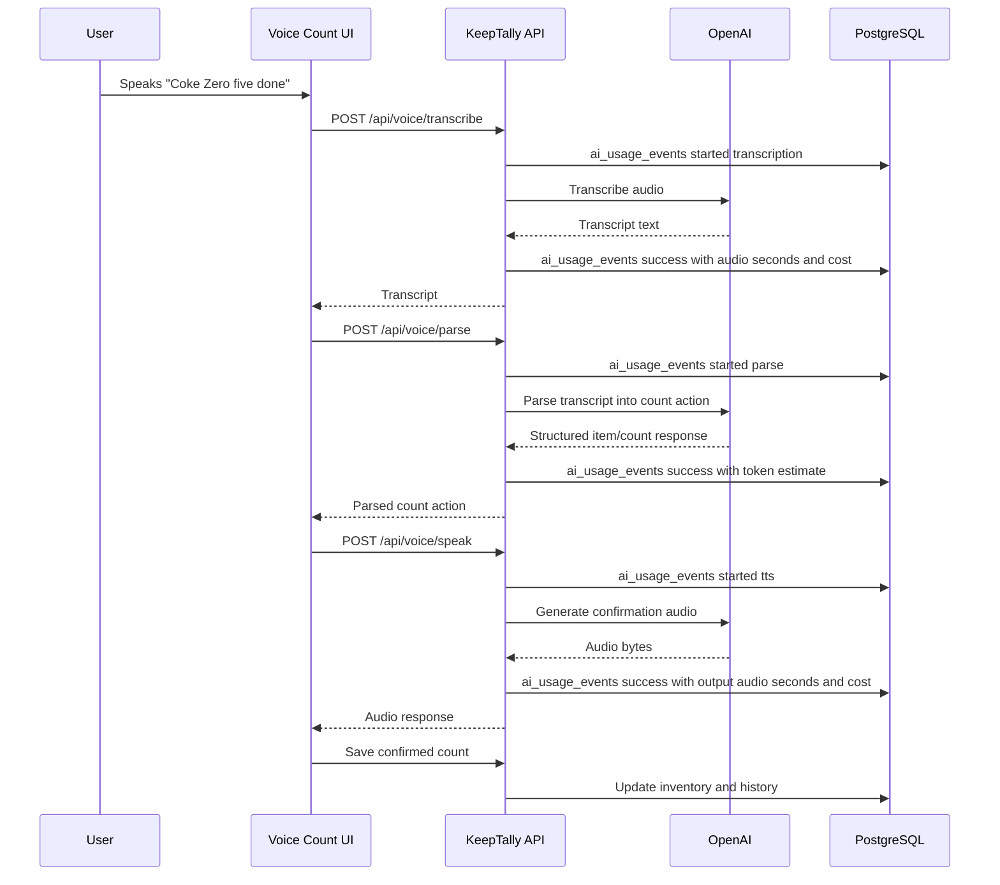

# AI Cost Tracking Workflow Design

This document proposes a customer-level AI usage and cost tracking layer for KeepTally. The goal is to understand the real AI cost per account, protect margins, support usage-based billing, and give administrators a clear view of which workflows consume the most AI resources.

## Purpose

KeepTally can use AI for voice transcription, voice parsing, text-to-speech confirmations, agent insights, reporting summaries, and future automation. Those calls may use OpenAI, a self-hosted OpenAI-compatible service, or a local fallback. Each call should produce a lightweight usage event so the business can answer four questions:

- Which customer generated the AI usage?
- Which workflow generated it?
- Which provider and model handled it?
- What did it cost or approximately cost?

The tracking layer should not store raw audio by default. It should store metadata, estimates, and operational status. Transcripts may be stored only when needed for audit, troubleshooting, or explicit customer configuration.

## High-Level Workflow



## Workflows To Track

| Workflow | Example endpoint | Cost source | Business reason |
| --- | --- | --- | --- |
| Voice transcription | `POST /api/voice/transcribe` | Audio input duration | Measures cost of hearing the user. |
| Voice parsing | `POST /api/voice/parse` | Text input/output tokens | Measures cost of turning transcript into action. |
| Voice speech | `POST /api/voice/speak` | Audio output duration/tokens | Measures cost of AI speaking back. |
| AI connectivity smoke tests | `GET /api/ai/connectivity` | Request count only | Separates health checks from billable user work. |
| Agent insights | Future `/api/agents/*` | Text tokens and DB scope | Measures scheduled/background AI cost. |
| Report summaries | Future `/api/reports/summary/ai` | Text tokens | Measures value-added reporting cost. |

## Proposed Database Tables

### `ai_usage_events`

This is the raw event table. One row represents one AI provider call or one local AI fallback attempt.

```sql
create table ai_usage_events (
  id bigserial primary key,
  account_id integer not null references accounts(id) on delete cascade,
  user_id integer references users(id) on delete set null,
  location_id integer references locations(id) on delete set null,
  workflow text not null,
  request_kind text not null,
  provider text not null,
  model text,
  status text not null,
  source text not null default 'server',
  request_id text,
  correlation_id text,
  input_tokens integer not null default 0,
  output_tokens integer not null default 0,
  cached_input_tokens integer not null default 0,
  audio_input_seconds numeric(10, 3) not null default 0,
  audio_output_seconds numeric(10, 3) not null default 0,
  estimated_cost_usd numeric(12, 6) not null default 0,
  latency_ms integer,
  error_code text,
  error_message text,
  metadata jsonb not null default '{}'::jsonb,
  created_at timestamp not null default now()
);
```

Recommended indexes:

```sql
create index ai_usage_events_account_created_idx
  on ai_usage_events (account_id, created_at);

create index ai_usage_events_account_workflow_created_idx
  on ai_usage_events (account_id, workflow, created_at);

create index ai_usage_events_account_provider_model_created_idx
  on ai_usage_events (account_id, provider, model, created_at);

create index ai_usage_events_correlation_idx
  on ai_usage_events (correlation_id);
```

### `ai_usage_daily_rollups`

This is a fast reporting table. It prevents dashboards and billing screens from scanning raw event history every time.

```sql
create table ai_usage_daily_rollups (
  id bigserial primary key,
  account_id integer not null references accounts(id) on delete cascade,
  usage_date date not null,
  workflow text not null,
  provider text not null,
  model text,
  request_count integer not null default 0,
  success_count integer not null default 0,
  error_count integer not null default 0,
  input_tokens bigint not null default 0,
  output_tokens bigint not null default 0,
  audio_input_seconds numeric(12, 3) not null default 0,
  audio_output_seconds numeric(12, 3) not null default 0,
  estimated_cost_usd numeric(12, 6) not null default 0,
  average_latency_ms integer,
  created_at timestamp not null default now(),
  updated_at timestamp not null default now(),
  unique (account_id, usage_date, workflow, provider, model)
);
```

Recommended indexes:

```sql
create index ai_usage_daily_rollups_account_date_idx
  on ai_usage_daily_rollups (account_id, usage_date);

create index ai_usage_daily_rollups_account_workflow_date_idx
  on ai_usage_daily_rollups (account_id, workflow, usage_date);
```

### `ai_usage_limits`

This table stores plan limits and warning thresholds per account.

```sql
create table ai_usage_limits (
  id serial primary key,
  account_id integer not null unique references accounts(id) on delete cascade,
  monthly_included_events integer,
  monthly_included_cost_usd numeric(12, 2),
  monthly_hard_cost_limit_usd numeric(12, 2),
  warning_threshold_percent integer not null default 80,
  overage_enabled boolean not null default false,
  overage_unit text not null default 'ai_event',
  overage_price_usd numeric(12, 4) not null default 0,
  created_at timestamp not null default now(),
  updated_at timestamp not null default now()
);
```

## Cost Calculation Model

The API should normalize usage into one internal estimate regardless of provider.

```text
estimated_cost_usd =
  text_input_tokens * input_token_rate
+ text_output_tokens * output_token_rate
+ cached_input_tokens * cached_input_rate
+ audio_input_seconds * audio_input_second_rate
+ audio_output_seconds * audio_output_second_rate
+ fixed_request_fee
```

For OpenAI, rates should be stored in configuration, not hardcoded in route handlers. For local AI, the direct per-call rate may be zero, but KeepTally should still estimate internal cost using an allocation model.

Example local AI allocation:

```text
monthly_ai_server_cost = 300
monthly_expected_ai_events = 100000
allocated_cost_per_event = 0.003
```

This lets the business compare OpenAI usage against self-hosted AI using the same reporting surface.

## API Design

### Internal Usage Service

Routes should call a shared service instead of inserting usage rows manually.

```ts
type AiUsageStartInput = {
  accountId: number;
  userId?: number;
  locationId?: number;
  workflow: "voice_count" | "agent_insight" | "report_summary" | "health_check";
  requestKind: "transcription" | "parse" | "tts" | "chat" | "embedding" | "connectivity";
  provider: "openai" | "localai" | "browser" | "none";
  model?: string;
  correlationId?: string;
  metadata?: Record<string, unknown>;
};

type AiUsageFinishInput = {
  status: "success" | "error" | "fallback" | "skipped";
  inputTokens?: number;
  outputTokens?: number;
  cachedInputTokens?: number;
  audioInputSeconds?: number;
  audioOutputSeconds?: number;
  latencyMs?: number;
  errorCode?: string;
  errorMessage?: string;
  metadata?: Record<string, unknown>;
};
```

### Admin Reporting Endpoints

```text
GET /api/admin/ai-usage/summary?from=YYYY-MM-DD&to=YYYY-MM-DD
GET /api/admin/ai-usage/accounts/:accountId
GET /api/admin/ai-usage/events?accountId=1&workflow=voice_count
GET /api/admin/ai-usage/limits/:accountId
PATCH /api/admin/ai-usage/limits/:accountId
```

### Account-Level Reporting Endpoints

```text
GET /api/ai-usage/me/summary?month=YYYY-MM
GET /api/ai-usage/me/workflows?month=YYYY-MM
```

Customer-facing screens should show usage counts and included limits, not raw internal provider errors.

## Voice Count Example



## Billing Strategy

KeepTally should not expose raw token math to customers. Package the cost into understandable plan units.

### Option A: Included Usage

```text
Starter: 1,000 AI actions/month included
Team: 5,000 AI actions/month included
Pro: 20,000 AI actions/month included
```

Pros:

- Easy for customers to understand.
- Protects early sales from confusing token language.
- Makes AI feel included.

Cons:

- Needs internal tracking to prevent margin surprises.

### Option B: Cost Allowance

```text
Starter: $10 AI usage included
Team: $50 AI usage included
Pro: $150 AI usage included
```

Pros:

- Maps cleanly to real provider cost.
- Useful for heavy voice accounts.

Cons:

- Feels more technical and less friendly.

### Option C: Hybrid

Recommended.

```text
Plan includes a fixed number of AI actions.
Internal systems also track estimated cost.
If either usage or cost is abnormal, admins receive a warning.
```

## Admin Dashboard Design

The first dashboard should be operational, not overly financial.

Cards:

- AI usage this month.
- Estimated AI cost this month.
- Cost per account.
- Cost per workflow.
- Error and fallback rate.
- Average transcription latency.
- Average TTS latency.

Useful tables:

- Top accounts by AI cost.
- Top workflows by AI cost.
- Failed AI calls by provider/model.
- Accounts near monthly limit.

## Guardrails

- Do not store raw audio by default.
- Redact secrets and API keys from metadata.
- Store provider request IDs when available.
- Keep raw usage rows for 90-180 days in test environments.
- Keep daily/monthly rollups longer.
- Treat health checks as non-billable.
- Treat browser fallback speech as zero provider cost but track it as a fallback event.
- Log failed calls with enough detail to debug without exposing private inventory data.

## Implementation Phases

### Phase 1: Passive Tracking

- Add `ai_usage_events`.
- Add shared `aiUsageService`.
- Track voice transcription, parse, and speech.
- Add admin-only summary endpoint.
- Add preflight check that table/indexes exist.

### Phase 2: Rollups and Dashboard

- Add `ai_usage_daily_rollups`.
- Add daily rollup job.
- Add admin dashboard cards.
- Add per-account workflow breakdown.

### Phase 3: Limits and Alerts

- Add `ai_usage_limits`.
- Warn admins when an account crosses 80% of included usage.
- Add soft limit behavior.
- Add overage-ready reporting.

### Phase 4: Billing Integration

- Export monthly usage.
- Add Stripe or invoice integration later.
- Support per-plan included AI actions.
- Support managed private-AI customers separately.

## Recommended First Build

Build Phase 1 only at first. That gives KeepTally immediate visibility without changing customer pricing or blocking workflows.

Minimum first implementation:

- `ai_usage_events` table.
- Track `/api/voice/transcribe`.
- Track `/api/voice/parse`.
- Track `/api/voice/speak`.
- Add `GET /api/admin/ai-usage/summary`.
- Show an admin-only "AI Usage" panel with month-to-date cost, request count, and fallback rate.

This is enough to validate real customer usage during testing before choosing exact billing limits.
