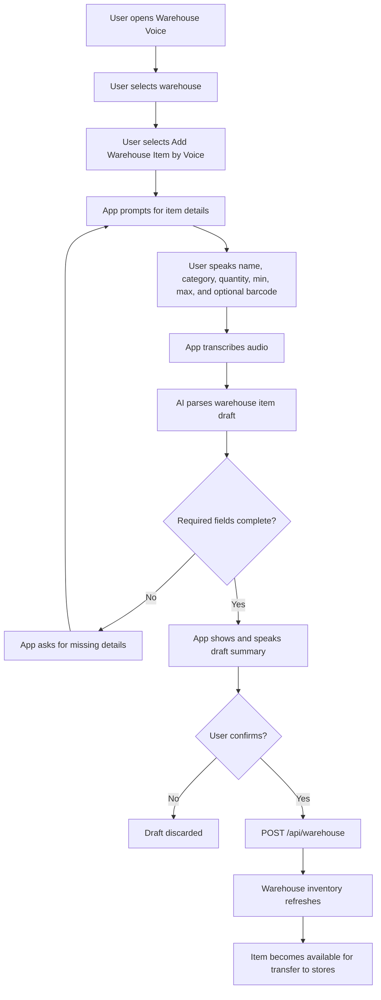

# AI Voice Add Warehouse Item Workflow Design

Date: 2026-06-06

Status: Updated for warehouse-only item creation

Audience: Business owners, operations leadership, inventory managers, implementation team

## Executive Summary

KeepTally should create new inventory items at the warehouse level only. Store locations should not create new item records directly; stores receive inventory through transfers from the warehouse.

The voice add-item workflow should therefore live in the warehouse workflow. AI helps collect and organize item details, but it does not write inventory until the user clearly confirms the draft.

In plain terms:

- The warehouse user speaks the new item information.
- AI turns the speech into a structured warehouse item draft.
- The app shows and speaks the draft back.
- The user confirms or cancels.
- KeepTally creates the item through the warehouse inventory API.
- Store locations receive that item later through the transfer workflow.

## Business Goal

This feature should make warehouse setup faster without weakening control.

Expected business outcome:

- Authorized warehouse users can add missing items without typing every field manually.
- The system captures item name, category, starting quantity, minimum quantity, maximum quantity, reorder point, and optional UPC or barcode.
- The final item appears in warehouse inventory first.
- Store inventory remains controlled by warehouse transfers.

## Workflow



## Example Voice Dialog

User:

> Add new item. Coke Zero twenty ounce, drinks, quantity twelve, minimum six, maximum twenty-four, barcode zero four nine zero zero zero four two five six six.

KeepTally:

> I heard Coke Zero 20 ounce, category drinks, quantity 12, minimum 6, maximum 24, barcode 049000042566. Say confirm to create it in warehouse inventory, or no to cancel.

User:

> Confirm.

KeepTally:

> Created Coke Zero 20 ounce in warehouse inventory with quantity 12.

## Required Fields

| Field | Required | Source |
| --- | --- | --- |
| Warehouse | Yes | Selected app warehouse |
| Item name | Yes | Spoken by user |
| Category | Yes | Spoken by user |
| Quantity | Yes | Spoken by user |
| Minimum quantity | Yes | Spoken by user |
| Maximum quantity | Yes | Spoken by user |
| Reorder point | No | Defaults to minimum quantity in first implementation |
| Barcode or UPC | Optional for dev, recommended before production | Spoken, scanned, or typed |

Current implementation note: the backend currently resolves writes to the active/default warehouse. The UI should present that as the selected warehouse until a full multi-warehouse API is exposed.

## Validation Rules

Before creating the item, the backend should validate:

- User has `edit_warehouse`.
- User has warehouse-level access.
- Item name is not blank.
- Category is not blank.
- Quantity is zero or greater.
- Minimum quantity is zero or greater.
- Maximum quantity is greater than or equal to minimum quantity.
- Barcode is normalized before storage.
- Duplicate warehouse item names are warned before creation.
- The item is not created unless the user confirms.

## API Design

### Draft Parse Endpoint

`POST /api/voice/warehouse/add-item/draft`

Purpose:

- Accept transcript.
- Return a structured warehouse item draft.
- Never write inventory.

Example request:

```json
{
  "transcript": "add coke zero twenty ounce drinks quantity twelve minimum six maximum twenty four"
}
```

Example response:

```json
{
  "status": "draft",
  "draft": {
    "name": "Coke Zero 20oz",
    "category": "Drinks",
    "quantity": 12,
    "minQuantity": 6,
    "maxQuantity": 24,
    "barcode": null,
    "location": "Warehouse"
  },
  "missingFields": [],
  "warnings": []
}
```

### Confirm Create Endpoint

`POST /api/warehouse`

The voice workflow should pass the confirmed draft into the same API path used by manual warehouse item creation.

## Store Location Rule

Store locations should not use voice add-item creation.

Correct store workflow:

1. Item is created in warehouse inventory.
2. Warehouse inventory holds the canonical item details.
3. The item is transferred from warehouse to a store location.
4. Store counts and adjustments happen after the transfer exists.

## Acceptance Criteria

The feature is ready for dev validation when:

- Warehouse Voice shows an Add Warehouse Item by Voice action.
- Store Voice Count does not show an Add Item by Voice action.
- The draft parser uses `edit_warehouse`.
- The confirmed save calls `POST /api/warehouse`.
- The app refuses to create without a clear affirmation.
- The created item appears in warehouse inventory.
- Store inventory is updated only through transfer workflows.
