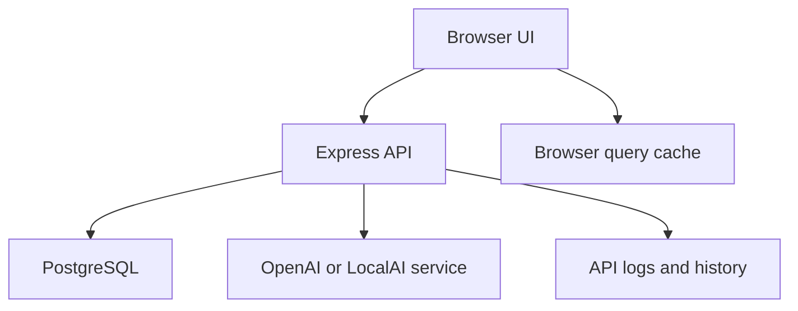

# Concurrency Review and Recommendations

Date: 2026-06-03

Status: Architecture recommendation

Audience: Business owners, operations leadership, implementation team

## Executive Summary

Concurrency describes what happens when multiple users, browser tabs, API requests, scanner sessions, voice workflows, or background agents try to read and update the same inventory system at the same time.

For KeepTally, concurrency matters most in these areas:

- Inventory quantity updates.
- Voice count confirmations.
- Barcode scanner actions.
- Warehouse-to-store transfers.
- User permission changes.
- AI agent recommendations.
- Dashboard and report refreshes.

The goal is not to make every operation run at the same time. The goal is to let many users work smoothly while preventing duplicate writes, lost updates, stale reads, and unclear audit history.

## Primary Concurrency Risks

| Area | Risk | Example |
| --- | --- | --- |
| Inventory updates | Lost update | Two users update the same item quantity at nearly the same time |
| Voice count | Duplicate save | User repeats a spoken confirmation and the app saves twice |
| Scanner | Repeated camera reads | Camera reads the same UPC multiple times in seconds |
| Transfers | Partial write | Warehouse decreases but store increase fails |
| AI agents | Unsafe automation | Agent suggests or writes changes while a user is editing |
| Permissions | Stale authorization | User loses access but old browser data still allows action |
| Reports | Stale display | Dashboard shows old counts after a write |

## Current App-Specific Concurrency Model

KeepTally currently behaves like a request-response web application:



This is a reasonable starting point. The main concurrency control should happen in PostgreSQL and in the API layer, not in the browser.

## Recommended Principles

### 1. Database Writes Must Be Transactional

Any workflow that updates more than one table should use a transaction.

Examples:

- Warehouse transfer.
- Add warehouse product to store.
- Scanner create product plus create identifier plus create inventory.
- Voice count save plus history insert.

Business reason:

The system should not save half of an operation.

### 2. Inventory Updates Should Be Atomic

Quantity changes should be written as one database operation where possible.

Preferred pattern:

```text
update item
set quantity = quantity + adjustment
where id = item_id and account_id = account_id
```

This is safer than reading quantity first, calculating in application memory, and writing it back later.

### 3. Confirmed Voice And Scanner Saves Need Idempotency

Idempotency means the same save request cannot accidentally apply twice.

Recommended approach:

- Generate a `client_action_id` for every confirmed save.
- Store that ID with the history or count session event.
- Reject or return the existing result if the same action ID is submitted again.

Business reason:

If a mobile connection retries or a user taps twice, inventory should not double-adjust.

### 4. Use Optimistic Concurrency For Manual Edits

Manual edit screens should track `updated_at` or a version number.

Recommended behavior:

- User loads item.
- User edits item.
- API saves only if `updated_at` still matches.
- If another user already changed it, API returns a conflict.

Business reason:

This prevents one user from unknowingly overwriting another user.

### 5. Use Row Locks For Critical Multi-Step Operations

For transfers and batch scanner saves, use row-level locks inside a transaction.

Recommended PostgreSQL pattern:

```text
select ... for update
```

Use this only for short operations. Do not hold locks while waiting on OpenAI, user input, or browser confirmation.

### 6. AI Agents Should Recommend First, Write Later

AI and middleware agents should not directly modify inventory unless the workflow is explicitly approved.

Recommended pattern:

- Agent reads data.
- Agent creates a recommendation.
- User or manager confirms.
- API applies the change transactionally.

Business reason:

This keeps AI useful without letting it create silent operational changes.

## Workflow-Specific Recommendations

### Voice Count

Concurrency risks:

- User says the same count twice.
- Browser retries the save request.
- Transcript completes after the user changed location.
- Another user updates the same item during the voice session.

Recommendations:

- Store a count session ID.
- Store each parsed transcript as a count session event.
- Require affirmative confirmation before writing.
- Attach a `client_action_id` to the confirmed save.
- Recheck item and location before saving.
- Use atomic quantity update or optimistic concurrency depending on workflow type.

### Mobile Scanner

Concurrency risks:

- Camera scans same barcode repeatedly.
- User scans while location is wrong.
- Product identifier is changed while scanner session is active.
- Unknown code is created twice by two users.

Recommendations:

- Keep client-side scan cooldown.
- Normalize identifiers server-side.
- Use database uniqueness or review rules for normalized identifiers.
- Use scanner session events for future multi-scan batches.
- Recheck product identifier status during save.

### Warehouse Transfer

Concurrency risks:

- Two users transfer the same warehouse inventory.
- Store update succeeds but warehouse update fails.
- Negative warehouse quantity.

Recommendations:

- Use a transaction.
- Lock source warehouse row.
- Lock destination store row if it exists.
- Reject transfer if quantity would go below zero.
- Write one transfer history record with both sides of the movement.

### Admin And Permissions

Concurrency risks:

- User permissions change while the user is active.
- Cached permission data allows stale access.

Recommendations:

- Keep permission cache TTL short.
- Recheck authorization on every write endpoint.
- Invalidate permission cache after user or role changes.
- Consider session revocation later for production.

### Dashboard And Reports

Concurrency risks:

- Dashboard shows stale data after writes.
- Reports read partial data during multi-step writes.

Recommendations:

- Invalidate dashboard query cache after writes.
- Use transactions so reports never see half-completed operations.
- Add short API cache only for stable reads.
- Avoid caching critical write results.

## Recommended Technical Controls

| Control | Where | Priority |
| --- | --- | --- |
| Database transactions | API write endpoints | High |
| Atomic quantity updates | Inventory adjustments | High |
| Idempotency keys | Voice, scanner, mobile saves | High |
| Row locks | Transfers and batch saves | High |
| Optimistic concurrency | Manual item edits | Medium |
| Short cache TTLs | Browser and API cache | Medium |
| Advisory locks | Rare account-level maintenance jobs | Low |
| Queue workers | AI agents and scheduled jobs | Future |

## Suggested Implementation Order

### Phase 1: Protect Inventory Writes

- Review write endpoints for transaction coverage.
- Add idempotency keys to voice and scanner saves.
- Add atomic quantity update helpers.
- Add tests for duplicate save attempts.

### Phase 2: Protect Transfers And Batch Operations

- Add row locks for warehouse transfer source rows.
- Add transaction coverage for add-to-store and create-product scanner actions.
- Add multi-scan session model if batch scanning is approved.

### Phase 3: Improve Stale Data Handling

- Add optimistic concurrency to manual item edit forms.
- Standardize cache invalidation after writes.
- Add API response metadata showing when data was last updated.

### Phase 4: Agent And Worker Safety

- Keep AI agent writes disabled by default.
- Add recommendation records.
- Add approval workflow.
- Add worker queue if scheduled AI jobs become frequent.

## Big-O And Performance Notes

Concurrency safety should not make the app slow if indexes and transaction scopes are kept tight.

Expected performance targets:

- Product identifier lookup: `O(log n)` with account and normalized code index.
- Item lookup by account, product, and location: `O(log n)` with product/location index.
- Location item list: `O(log n + k)`, where `k` is items at that location.
- Dashboard summary: depends on aggregation size, but should use account/location filters.
- Idempotency lookup: `O(log n)` with a unique action ID index.

The most important rule is to keep write transactions short. Do not call OpenAI inside a database transaction.

## Recommended Acceptance Criteria

Concurrency improvements should be considered successful when:

- Duplicate voice confirmations do not double-save.
- Duplicate scanner submissions do not double-adjust inventory.
- Transfers cannot create negative warehouse counts.
- Product creation and identifier creation happen together or not at all.
- Two users editing the same item receive a clear conflict instead of silent overwrite.
- Reports and dashboards refresh after successful writes.
- AI agents cannot silently alter inventory without approval.

## Recommendation

Proceed with Phase 1 after the dev scanner identity work is validated. The highest-value next step is adding idempotency protection and transaction coverage around voice count saves, scanner saves, and warehouse transfer operations.
