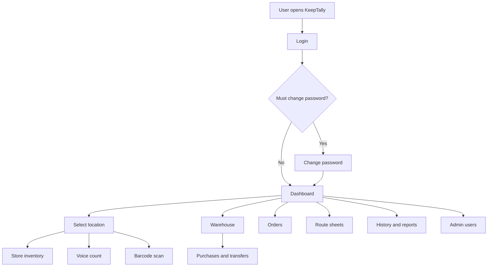
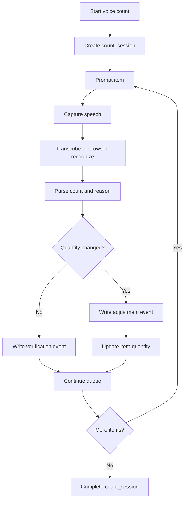

# KeepTally Current Application Use Cases

Last reviewed: May 30, 2026

## Purpose

KeepTally is a test-stage inventory operations application for store and warehouse inventory control. The current code suggests the prior programmer intended it to help operators:

- Sign in with role-based permissions.
- Select a store location.
- Count vending-style store inventory.
- Adjust or verify item quantities.
- Use voice prompts to move through inventory counts faster.
- Scan barcodes to find, create, verify, or adjust items.
- Manage warehouse stock, purchases, transfers, and reorder lists.
- Generate orders and route sheets for replenishment work.
- Review history and operational changes.

The application is not just a static inventory list. It is designed as an operations workflow tool where actions create history, scan logs, purchase records, transfer records, or order records.

## Route Map

Frontend routes are declared in `artifacts/keep-tally/src/App.tsx`.

| User path | Screen | Main purpose |
| --- | --- | --- |
| `/login` | Login | Sign in with username and password. |
| `/change-password` | Change password | Force a first-time or admin-reset password update. |
| `/` | Dashboard | Show inventory summaries, low stock, and status cards. |
| `/inventory` | Store inventory | Browse, create, edit, delete, verify, and adjust store items. |
| `/voice-check` | Store voice count | Count store items by voice against expected par levels. |
| `/scan` | Barcode scan | Look up barcodes and perform scan-based item actions. |
| `/restock` | Restock | Review restock needs and export restock CSV data. |
| `/history` | History | Review inventory change history. |
| `/orders` | Orders | Create and manage pick lists/orders. |
| `/orders/:id` | Order detail | Edit an order and receive order items. |
| `/orders/:id/print` | Print order | Print an order or pick list. |
| `/route-sheets` | Route sheets | Build and manage route work sheets. |
| `/warehouse` | Warehouse | Manage warehouse inventory. |
| `/warehouse/:id` | Warehouse item detail | Review item-level warehouse details, purchases, and transfers. |
| `/warehouse/purchases` | Warehouse purchases | Review purchase history and cost analytics. |
| `/warehouse/voice` | Warehouse voice count | Count warehouse items by voice. |
| `/import` | Store import | Preview and apply CSV/XLSX inventory imports. |
| `/admin/users` | User management | Manage users, passwords, roles, and permissions. |
| `/settings` | Settings | Placeholder for system settings and readiness items. |

Backend routes are mounted in `artifacts/api-server/src/routes/index.ts`. Public routes are health and authentication. Most other API routes require an authenticated user, active account membership, and sometimes a specific permission.

## Permission Model

The app uses JWT cookies for sessions and then loads user, account, role, permissions, and location access on each protected request.

Important permission gates:

- `manage_users`: user and permission administration.
- `edit_store_inventory`: create or edit store inventory, orders, route sheets, imports, and restock workflows.
- `delete_items`: delete store items.
- `mark_adjustments`: apply store quantity adjustments.
- `scan_barcodes`: use barcode scan workflows.
- `use_voice_mode`: use voice count workflows.
- `view_warehouse`: view warehouse inventory.
- `edit_warehouse`: create, edit, import, and delete warehouse items.
- `receive_purchases`: receive warehouse purchases.
- `transfer_inventory`: transfer warehouse stock to store locations.
- `view_all_locations`: see all locations instead of assigned locations only.

Current design note: the app is partly normalized around `locations.id` and `user_location_assignments`, but some helper code still uses legacy location names from `users.assigned_locations`. This works as a bridge, but it should be cleaned up before production use.

## Overall Workflow

## Use Case 1: Login and Session

Files:

- `artifacts/keep-tally/src/pages/login.tsx`
- `artifacts/keep-tally/src/pages/change-password.tsx`
- `artifacts/keep-tally/src/contexts/auth-context.tsx`
- `artifacts/api-server/src/routes/auth.ts`
- `artifacts/api-server/src/services/auth-service.ts`
- `artifacts/api-server/src/middleware/auth.ts`

Workflow:

1. User opens `/login`.
2. User enters username and password.
3. Frontend posts to `POST /api/auth/login`.
4. Backend verifies the password hash in the `users` table.
5. Backend sets `kt_token` as an HTTP-only cookie.
6. Frontend calls `GET /api/auth/me` to load the signed-in user.
7. If `must_change_password` is true, the user is redirected to `/change-password`.
8. Logout posts to `POST /api/auth/logout`, which clears the cookie.

Persisted data:

- User password hashes are stored in `users.password_hash`.
- Session state is stored client-side as an HTTP-only JWT cookie, not in a sessions table.

Known gaps:

- Test environments still need secure random `SESSION_SECRET` values.
- Browser CORS and cookie settings must match the exact site origin used for testing.
- The first admin user must exist in the database before login can work.

## Use Case 2: Dashboard

Files:

- `artifacts/keep-tally/src/pages/dashboard.tsx`
- `artifacts/api-server/src/routes/dashboard.ts`

Workflow:

1. User opens `/`.
2. Frontend requests summary data from `GET /api/dashboard/summary`.
3. Dashboard calculates totals, low stock, out-of-stock items, inventory value, and location/category rollups.
4. Voice-related dashboard data is available through `GET /api/dashboard/voice`.

Persisted data:

- Dashboard does not create records. It reads inventory and history data.

Known gaps:

- Dashboard accuracy depends on the meaning of `quantity` and `par_level` being consistent across store and warehouse workflows.

## Use Case 3: Location Selection

Files:

- `artifacts/keep-tally/src/contexts/location-context.tsx`
- `artifacts/keep-tally/src/components/layout.tsx`
- `artifacts/api-server/src/routes/locations.ts`

Workflow:

1. The app layout shows a location selector.
2. Some screens use the shared selected location.
3. Some screens, especially voice count, load live locations from `GET /api/locations`.

Persisted data:

- Locations are stored in `locations`.
- User-to-location access is stored in `user_location_assignments`, with a legacy fallback in `users.assigned_locations`.

Known gaps:

- The shared frontend location context still has hardcoded locations. This can drift from the database, especially when the database has more locations than the hardcoded list.

## Use Case 4: Store Inventory Management

Files:

- `artifacts/keep-tally/src/pages/inventory.tsx`
- `artifacts/api-server/src/routes/items.ts`

Workflow:

1. User opens `/inventory`.
2. Frontend requests `GET /api/items`, optionally filtered by location.
3. User can create an item through `POST /api/items`.
4. User can edit an item through `PATCH /api/items/:id`.
5. User can delete an item through `DELETE /api/items/:id`.
6. User can adjust inventory through `POST /api/items/:id/adjust` or the more general `POST /api/inventory/adjustments`.
7. User can verify an item through `POST /api/items/:id/verify`.

Persisted data:

- Items are stored in `items`.
- Creates, updates, deletes, adjustments, and verifications write to `history`.
- General adjustment and scan paths may also write to `scan_log`.

Accounting interpretation:

- `quantity` is the system count.
- `par_level` is the desired target level.
- Adjustments are the accounting-significant changes because they update quantity and create history.
- Verifications create history, but they do not change quantity.

Known gaps:

- Store voice count compares spoken count against `par_level`, while scan and inventory pages often compare against current `quantity`. The business meaning should be confirmed.

## Use Case 5: Store Voice Count

Files:

- `artifacts/keep-tally/src/pages/voice-check.tsx`
- `artifacts/keep-tally/src/hooks/use-ai-voice.ts`
- `artifacts/api-server/src/routes/voice.ts`
- `artifacts/api-server/src/routes/items.ts`

Workflow:

1. User opens `/voice-check`.
2. User selects a location.
3. User selects a count mode:
   - All items.
   - Low-stock items.
   - Category.
   - Custom voice command mode.
4. App builds a queue from the selected store items.
5. App speaks the current item name and expected par level.
6. Browser records a short audio clip through `MediaRecorder`.
7. Frontend uploads the audio blob to `POST /api/voice/transcribe`.
8. Backend uses the configured OpenAI-compatible speech-to-text service.
9. Frontend posts transcript and item context to `POST /api/voice/parse`.
10. Backend returns a structured action such as count, verify, skip, done, reason, or unknown.
11. If the spoken count equals the expected par level, frontend calls `POST /api/items/:id/verify`.
12. If the spoken count is different, frontend may ask for a reason and then calls `POST /api/items/:id/adjust`.
13. Frontend keeps a session summary in memory until the page is closed or reset.

What gets recorded:

- The raw audio clip is uploaded in memory for transcription.
- The code does not save raw audio files to disk or database.
- The transcript is displayed in the browser as the last heard phrase, but the code does not persist a transcript table.
- The durable record is the resulting `history` row from verification or adjustment.

Accounting interpretation:

- This is a fast count workflow, not a full audit workflow.
- It records the final inventory action, but it does not preserve the complete voice session.
- If accounting requires traceability, the next design should add a `count_sessions` table and `count_session_events` table.

Recommended accounting upgrade:

- Add `count_sessions`: account, user, location, mode, started_at, completed_at, status.
- Add `count_session_events`: session, item, expected_quantity, counted_quantity, action, reason, transcript, confidence, created_at.
- Do not store raw audio by default unless there is a written retention policy.

## Use Case 6: Warehouse Voice Count

Files:

- `artifacts/keep-tally/src/pages/warehouse-voice.tsx`
- `artifacts/keep-tally/src/hooks/use-voice.ts`
- `artifacts/api-server/src/routes/warehouse.ts`

Workflow:

1. User opens `/warehouse/voice`.
2. Frontend loads warehouse items from `GET /api/warehouse`.
3. User selects all, low stock, category, or AI-style command mode.
4. Browser uses the Web Speech API through `SpeechRecognition`.
5. App parses the spoken quantity locally.
6. If the count differs, frontend updates the item with `PUT /api/warehouse/:id`.
7. If the count matches, the app records the result only in the current frontend session summary.

What gets recorded:

- The browser does not upload raw audio to the server for this workflow.
- Changed quantities are persisted through warehouse item updates.
- Unchanged verifications are not currently persisted as a warehouse audit record.

Known gap:

- Warehouse voice should gain a persisted verification history row even when quantity does not change.

## Use Case 7: Barcode Scan

Files:

- `artifacts/keep-tally/src/pages/scan.tsx`
- `artifacts/api-server/src/routes/scan.ts`
- `artifacts/api-server/src/routes/items.ts`

Workflow:

1. User opens `/scan`.
2. User scans or enters a barcode.
3. Frontend calls `GET /api/scan/lookup?barcode=...`.
4. Backend searches store items for the selected location and may also search warehouse items.
5. User can:
   - Verify a count.
   - Apply a verified count.
   - Add an item from another location to the current store.
   - Create a new item for an unknown barcode.
   - Adjust quantity with a reason.
6. Frontend posts the chosen action to `POST /api/scan/action`.
7. Backend writes `history` and `scan_log` records.

Persisted data:

- Item changes go to `items`.
- Audit entries go to `history`.
- Barcode activity goes to `scan_log`.

Known gap:

- Barcode normalization is stronger in some item lookup paths than in the scan lookup path. This should be standardized.

## Use Case 8: Natural Language Command

Files:

- `artifacts/api-server/src/routes/command.ts`
- `artifacts/api-server/src/lib/commandParser.ts`

Workflow:

1. User enters a command like "Set Coke Zero in Mesa to 24".
2. Frontend posts text to `POST /api/command`.
3. Backend parses intent.
4. Backend loads allowed inventory items.
5. Backend creates or adjusts items if permissions allow.
6. Backend writes a `history` row with source `command`.

Persisted data:

- Item creates and quantity updates affect `items`.
- Command results are recorded in `history`.

Known gap:

- The parser is useful, but it should have a visible review/confirm step before sensitive changes in production.

## Use Case 9: Import Store Inventory

Files:

- `artifacts/keep-tally/src/pages/import.tsx`
- `artifacts/api-server/src/routes/import.ts`

Workflow:

1. User opens `/import`.
2. User uploads a CSV or spreadsheet.
3. Frontend posts the file to `POST /api/import/preview`.
4. Backend parses rows and returns preview results.
5. User confirms import.
6. Frontend posts to `POST /api/import/apply`.
7. Backend creates or updates store inventory records.

Persisted data:

- Store inventory rows are inserted or updated in `items`.
- Import changes write to `history`.

Known gap:

- Import should remain strict about required columns, duplicate barcodes, negative quantities, and unknown locations.

## Use Case 10: Restock

Files:

- `artifacts/keep-tally/src/pages/restock.tsx`
- `artifacts/api-server/src/routes/restock.ts`

Workflow:

1. User opens `/restock`.
2. Frontend calls `GET /api/restock`.
3. Backend returns items below par.
4. User can download `GET /api/restock.csv`.

Persisted data:

- Restock does not create records by itself. It reads item and par data.

Known gap:

- Restock is a report today. It could be connected to order generation or warehouse transfer suggestions.

## Use Case 11: History

Files:

- `artifacts/keep-tally/src/pages/history.tsx`
- `artifacts/api-server/src/routes/history.ts`

Workflow:

1. User opens `/history`.
2. Frontend calls `GET /api/history`.
3. Backend returns inventory history filtered by account and location access.

Persisted data:

- Reads from `history`.

Known gap:

- History is the closest thing to the current audit ledger, but it does not group related actions into sessions.

## Use Case 12: Orders

Files:

- `artifacts/keep-tally/src/pages/orders.tsx`
- `artifacts/keep-tally/src/pages/order-detail.tsx`
- `artifacts/keep-tally/src/pages/order-print.tsx`
- `artifacts/api-server/src/routes/orders.ts`

Workflow:

1. User opens `/orders`.
2. User creates an order/pick list with source location, destination location, and line items.
3. User opens `/orders/:id` to edit quantities and item status.
4. User can archive or delete an order.
5. User can receive an order through `POST /api/orders/:id/receive`.
6. User can print the order through `/orders/:id/print`.

Persisted data:

- Orders are stored in `orders`.
- Order lines are stored in `order_items`.
- Receiving can update inventory and history depending on route behavior.

Known gap:

- Orders and warehouse transfers overlap conceptually. A future design should clearly define when to use each.

## Use Case 13: Route Sheets

Files:

- `artifacts/keep-tally/src/pages/route-sheets.tsx`
- `artifacts/api-server/src/routes/route-sheets.ts`

Workflow:

1. User opens `/route-sheets`.
2. User creates a route sheet with route date, driver, vehicle, stops, and checklist information.
3. User edits a route sheet with `PUT /api/route-sheets/:id`.
4. User views a route sheet with `GET /api/route-sheets/:id`.

Persisted data:

- Route sheets are stored in `route_sheets`.
- Stops are stored in `route_sheet_stops`.
- Stop items are stored in `route_sheet_items`.
- Checklist entries are stored in `route_sheet_checklist`.

Known gap:

- There is no delete route listed for route sheets in the current API scan.

## Use Case 14: Warehouse Inventory

Files:

- `artifacts/keep-tally/src/pages/warehouse.tsx`
- `artifacts/keep-tally/src/pages/warehouse-detail.tsx`
- `artifacts/api-server/src/routes/warehouse.ts`
- `artifacts/api-server/src/routes/warehouse-write-fixes.ts`

Workflow:

1. User opens `/warehouse`.
2. Frontend calls `GET /api/warehouse` and `GET /api/warehouse/dashboard`.
3. User can create, update, or delete warehouse items.
4. User can receive purchases through `POST /api/warehouse/:id/receive`.
5. User can transfer stock to a store through `POST /api/warehouse/:id/transfer`.
6. User can export CSV files for all warehouse inventory or reorder needs.
7. User can import warehouse data through preview and apply endpoints.

Persisted data:

- Warehouse inventory is stored in `warehouse_items`.
- Purchases are stored in `warehouse_purchases`.
- Transfers are stored in `warehouse_transfers`.
- Store-side transfer effects update `items`.
- Some actions write to `history`.

Known gap:

- There are overlapping warehouse route implementations in `warehouse.ts` and `warehouse-write-fixes.ts`. This should be consolidated to reduce route-order surprises.

## Use Case 15: Warehouse Purchases

Files:

- `artifacts/keep-tally/src/pages/warehouse-purchases-page.tsx`
- `artifacts/api-server/src/routes/warehouse.ts`

Workflow:

1. User opens `/warehouse/purchases`.
2. Frontend calls `GET /api/warehouse/purchases`.
3. Backend returns purchase records, vendor summaries, costs, and filter options.
4. User can export purchases through `GET /api/warehouse/purchases/export`.

Persisted data:

- Reads from `warehouse_purchases` joined to `warehouse_items`.

Known gap:

- Purchase data has cost analytics, but it is not yet connected to AI recommendations or reorder forecasting.

## Use Case 16: User and Permission Administration

Files:

- `artifacts/keep-tally/src/pages/user-management.tsx`
- `artifacts/api-server/src/routes/users.ts`

Workflow:

1. Admin opens `/admin/users`.
2. Admin views users with `GET /api/users`.
3. Admin creates users with `POST /api/users`.
4. Admin updates users, roles, locations, and active status with `PATCH /api/users/:id`.
5. Admin resets a password with `POST /api/users/:id/reset-password`.
6. Admin deletes a user with `DELETE /api/users/:id`.
7. Admin reviews and updates role permissions through `/api/permissions`.

Persisted data:

- Users are stored in `users`.
- Account memberships are stored in `account_users`.
- Role permissions are stored in `role_permissions`.
- Location assignments are stored in `user_location_assignments`.

Known gap:

- The app should keep test bootstrap admin creation separate from normal admin-user management.

## Use Case 17: Health and AI Connectivity

Files:

- `artifacts/api-server/src/routes/health.ts`
- `artifacts/api-server/src/lib/ai-config.ts`
- `artifacts/api-server/src/lib/openai.ts`

Workflow:

1. `GET /api/healthz` returns application health.
2. `GET /api/ai/status` reports whether AI endpoint values are configured.
3. `GET /api/ai/connectivity` calls the configured OpenAI-compatible models endpoint.

Persisted data:

- Health and AI checks do not create database records.

Known gap:

- Connectivity can succeed even when a model later fails to load. A deeper model smoke test should call a short chat completion against the selected model.

## Voice Workflow Accounting Review

The current voice system is useful for hands-free counting, but it is not yet a full accounting-grade voice audit system.

Current store voice persistence:

- Saves item verification to `history` through `POST /api/items/:id/verify`.
- Saves quantity changes to `items` and `history` through `POST /api/items/:id/adjust`.
- Does not save the full count session.
- Does not save raw audio.
- Does not save a durable transcript record.

Current warehouse voice persistence:

- Saves changed quantities through `PUT /api/warehouse/:id`.
- Does not save unchanged verifications.
- Does not save raw audio.
- Does not save a durable transcript record.

Recommended accounting upgrade:

Recommended tables:

- `count_sessions`: one row per voice, scan, or manual count session.
- `count_session_events`: one row per item counted, skipped, verified, or adjusted.
- `count_session_event_transcripts`: optional transcript storage if audit policy allows it.

Recommended retention rule:

- Keep structured events by default.
- Keep transcripts only if they help audit or training.
- Avoid storing raw audio unless the business has a written retention and privacy policy.

## Current Data Persistence Map

| Workflow | Main tables changed | Audit trail today |
| --- | --- | --- |
| Login | none | none |
| Password change | `users` | none |
| Store item create/edit/delete | `items` | `history` |
| Store item adjustment | `items` | `history` |
| Store voice verification | `history` | `history` only |
| Store voice adjustment | `items` | `history` |
| Barcode verify/apply | `items` when applied | `scan_log`, `history` |
| Barcode create/add/adjust | `items` | `scan_log`, `history` |
| Import apply | `items` | `history` |
| Warehouse item create/edit/delete | `warehouse_items` | partial `history` |
| Warehouse purchase receive | `warehouse_items`, `warehouse_purchases` | partial `history` |
| Warehouse transfer | `warehouse_items`, `items`, `warehouse_transfers` | `history` |
| Orders | `orders`, `order_items` | order records |
| Route sheets | `route_sheets`, stops, items, checklist | route records |
| User admin | `users`, memberships, permissions, assignments | no dedicated admin audit table |

## Priority Improvements

Phase 1: make current test workflows measurable.

- Add persistent count sessions and count session events.
- Persist warehouse voice verifications even when quantities do not change.
- Add admin audit history for user creates, disables, password resets, and permission changes.
- Replace hardcoded frontend locations with `GET /api/locations`.
- Standardize barcode normalization across scan and item lookup routes.

Phase 2: clean up relational design.

- Finish moving access control to `location_id` relationships.
- Keep legacy location names only for display and migration compatibility.
- Consolidate warehouse write routes.
- Add indexes for high-frequency filters: account, location, item, barcode, created date, and session id.

Phase 3: improve AI support.

- Add an AI-safe reporting view that reads summary data instead of raw operational tables.
- Add background recommendation jobs for low stock, overstock, stale inventory, unusual shrinkage, and vendor cost changes.
- Keep AI actions read-only by default until a user confirms a proposed adjustment.

## Testing Checklist By Use Case

- Login succeeds with seeded admin user.
- First login redirects to password change when `must_change_password` is true.
- CORS allows the exact VPS test origin.
- Store item list loads for assigned locations and all-location admins.
- Store item create, edit, delete, adjust, and verify write expected history rows.
- Store voice all-items mode moves through the queue and writes history.
- Store voice custom mode can match an item and apply a count.
- Store voice microphone-denied state displays a usable error.
- Warehouse list, dashboard, purchases, and detail pages load.
- Warehouse receive creates a purchase and increases quantity.
- Warehouse transfer decreases warehouse quantity and creates or updates store inventory.
- Warehouse voice changed count persists.
- Warehouse voice unchanged count should be tested and then upgraded to persist verification.
- Barcode lookup finds store and warehouse barcodes.
- Barcode create, add-to-store, verify, and adjust write scan log entries.
- Import preview rejects bad files and unknown locations.
- Import apply creates or updates the expected items.
- Orders can be created, edited, printed, received, archived, and deleted.
- Route sheets can be created, viewed, and edited.
- Admin can create users, reset passwords, assign locations, and update roles.
- Non-admin users cannot access admin routes.
- AI connectivity check returns configured model data in VPS test mode.

## Plain-English Summary

The prior programmer appears to have built KeepTally as a practical inventory operations prototype for vending-style work. The core idea is: sign in, choose a location, count items quickly, adjust what is wrong, and leave a history trail. Voice and barcode scanning are speed tools layered on top of the same inventory system.

For accounting, the app currently records the outcome of a voice workflow, not the complete voice workflow itself. That means quantity changes and verifications can be reviewed, but the app cannot yet prove the full spoken count session item by item. The next best upgrade is to add count session tables so every voice, scan, or manual count produces a clean audit record without storing raw audio by default.
