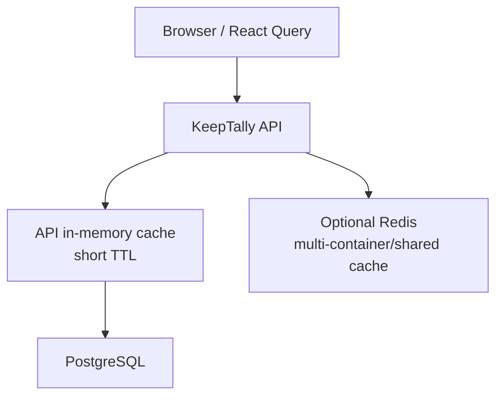
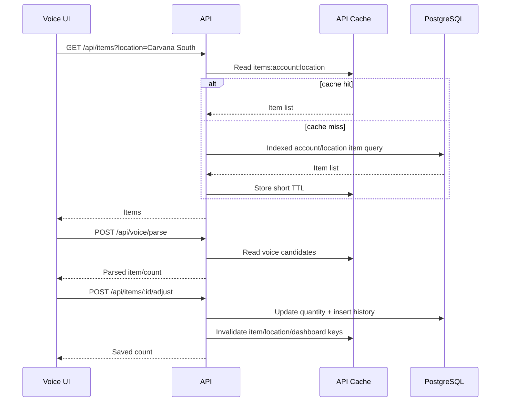

# Database Cache and Runtime Performance Design

This document proposes a practical caching strategy for KeepTally. The goal is to reduce repeated database reads during common workflows while keeping inventory counts, permissions, and audit history correct.

## Design Principle

KeepTally should cache stable or frequently repeated read data, not critical write results. Inventory writes should always go to PostgreSQL first and should invalidate affected cache entries immediately after a successful transaction.

Good cache candidates:

- Account settings.
- Active locations per account.
- User permissions and location access.
- Item lists per account/location.
- Category lists per account/location.
- AI status/connectivity summary.
- Voice candidate item lists for the selected location.

Poor cache candidates:

- Raw inventory adjustment writes.
- History inserts.
- Scan log inserts.
- Count session writes.
- Password/session security decisions unless backed by server-side session expiry.

## Recommended Cache Layers



### Layer 1: Browser Cache

The frontend already uses TanStack Query. This is useful for avoiding repeated UI fetches while a user stays on the same page.

Recommended use:

- Keep item/location queries fresh for a short time.
- Invalidate item, dashboard, and history query keys after writes.
- Avoid long stale times for inventory counts.

Suggested defaults:

```text
locations: stale 5 minutes
items by location: stale 15-60 seconds
dashboard summary: stale 30-60 seconds
AI status: stale 1-5 minutes
history: stale 15-30 seconds
```

### Layer 2: API In-Memory Cache

For the current single-container VPS test environment, use a small in-memory TTL cache inside the API process.

Best first targets:

- `locations:{accountId}`
- `permissions:{accountId}:{role}`
- `location-access:{accountId}:{userId}`
- `items:{accountId}:{locationId}`
- `voice-candidates:{accountId}:{locationId}`
- `ai-status`

Suggested TTLs:

```text
permissions: 5 minutes
locations: 5 minutes
items by location: 15-30 seconds
voice candidates: 15-30 seconds
AI status: 60 seconds
```

The TTLs should be short during testing. This keeps behavior predictable while still reducing repeated reads during voice workflows.

### Layer 3: Redis Later

Redis is useful only when KeepTally has multiple API containers or worker containers.

Use Redis later for:

- Shared account/location caches.
- Agent job queues.
- Rate limits.
- AI usage counters.
- Session revocation lists.

Do not add Redis just to make the current single-container test environment faster. Start with in-memory cache and measure first.

## Cache Invalidation Rules

Inventory writes must invalidate related read caches.

| Write operation | Invalidate |
| --- | --- |
| Create/update/delete item | `items:{accountId}:*`, `voice-candidates:{accountId}:*`, dashboard summary |
| Adjust item quantity | specific `items:{accountId}:{locationId}`, voice candidates for location, dashboard summary, history |
| Verify item | history, dashboard voice/verification summaries |
| Create/update location | `locations:{accountId}`, item/location access caches |
| Update user permissions | `permissions:{accountId}:*`, `location-access:{accountId}:{userId}` |
| Import CSV | account-wide item, dashboard, history, voice candidate caches |

When in doubt, invalidate account-wide cache keys after writes. Correctness is more important than squeezing every cache hit out of early testing.

## Voice Workflow Cache Path

Voice count mode repeatedly needs the same location item list and candidate item names.



## Big-O Impact

Without caching:

```text
Voice item list fetch: O(log n + k) database work with indexes
Local item matching: O(k * w) in browser, where k = items in selected location
Repeated count loop: repeated O(k) matching when user speaks item names
```

With short-lived item/location cache:

```text
Repeated item list reads: O(1) cache lookup plus O(k) serialization
Local item matching: still O(k * w), but avoids repeated DB round trips
Exact item lookup by ID/barcode: O(log n) with indexes
```

Caching does not change every algorithm to constant time. It removes repeated database round trips and keeps the hot working set close to the API/UI.

## First Implementation Recommendation

Build a small API cache utility:

```ts
type CacheEntry<T> = {
  value: T;
  expiresAt: number;
};

getOrSet<T>(key: string, ttlMs: number, loader: () => Promise<T>): Promise<T>
deleteByPrefix(prefix: string): void
deleteKey(key: string): void
```

Start with:

- Locations by account.
- Items by account/location.
- AI status.
- Role permissions.

Then add invalidation to:

- Item create/update/delete.
- Item adjust.
- CSV import.
- User permission changes.
- Location changes.

## Guardrails

- Cache keys must include `accountId`.
- Location-specific keys should include `locationId`, not only location name.
- Never cache one account's data under a global key.
- Invalidate after writes only after the database write succeeds.
- Keep TTLs short until field testing proves correctness.
- Log cache hit/miss rate only at debug level to avoid noisy production logs.

## What Not To Do Yet

- Do not introduce Redis before measuring the in-memory cache.
- Do not cache raw OpenAI responses that include user transcripts without a retention policy.
- Do not cache permission checks for long periods.
- Do not cache inventory writes or pretend a write succeeded before PostgreSQL confirms it.

## Recommended Order

1. Finish TypeScript build cleanup.
2. Add a small in-memory API cache helper.
3. Cache locations and items-by-location.
4. Add write invalidation.
5. Add cache metrics to preflight or admin diagnostics.
6. Evaluate Redis only when running multiple API/worker containers.
