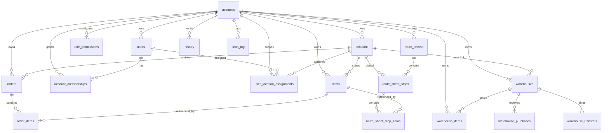

# KeepTally Database Schema Review

Generated: 2026-05-30

This document summarizes the PostgreSQL schema defined in `lib/db/src/schema`. The application uses Drizzle ORM, so these tables are the source of truth for application-level database structure.

## Big Picture

KeepTally is organized around an account-scoped inventory model. Most business data belongs to an `account_id`, and locations, users, items, orders, route sheets, warehouse records, history, and scan logs are intended to stay separated by account.

The core workflow is:

1. An account owns locations, warehouses, users, permissions, and inventory.
2. Store inventory lives in `items`.
3. Warehouse inventory lives in `warehouse_items`.
4. Stock movements and operational activity are tracked through `history`, `scan_log`, `orders`, `route_sheets`, `warehouse_purchases`, and `warehouse_transfers`.
5. User access is controlled by `users`, `account_memberships`, `role_permissions`, and `user_location_assignments`.

## Relationship Map



## Core Account And Access Tables

### `accounts`

Stores each customer/company/tenant.

Important columns:

| Column | Purpose |
| --- | --- |
| `id` | Primary key. |
| `name` | Human-readable account name. |
| `slug` | Unique account identifier used internally. |
| `status` | Account lifecycle state, default `active`. |
| `plan` | Plan/tier, default `legacy`. |
| `billing_email` | Optional billing contact. |
| `active` | Boolean active flag. |
| `created_at`, `updated_at` | Timestamps. |

Notes:

- `slug` is globally unique.
- Startup seed creates `Default Account` with slug `default`.

### `users`

Stores application login users.

Important columns:

| Column | Purpose |
| --- | --- |
| `id` | Primary key. |
| `account_id` | Optional link to `accounts.id`; set null if account is deleted. |
| `username` | Unique login name. |
| `display_name` | User-facing name. |
| `password_hash` | Hashed password only, not plaintext. |
| `role` | `admin`, `warehouse`, or `stocker`; defaults to `stocker`. |
| `assigned_locations` | Legacy text array of location names. |
| `active` | Whether the user can log in. |
| `must_change_password` | Forces password change after login. |
| `created_at`, `updated_at` | Timestamps. |

Indexes:

- `users_account_idx` on `account_id`.

Notes:

- `username` is globally unique, not account-scoped.
- Startup seed creates `admin` when no users exist.
- `assigned_locations` is legacy. The newer normalized assignment model is `user_location_assignments`.

### `account_memberships`

Connects users to accounts and stores role membership per account.

Important columns:

| Column | Purpose |
| --- | --- |
| `id` | Primary key. |
| `account_id` | Required account reference. |
| `user_id` | Required user reference. |
| `role` | Role within the account. |
| `active` | Whether this membership is active. |
| `created_at`, `updated_at` | Timestamps. |

Indexes:

- Unique `account_memberships_account_user_idx` on `(account_id, user_id)`.

### `role_permissions`

Stores account-scoped permission switches for each role.

Important columns:

| Column | Purpose |
| --- | --- |
| `id` | Primary key. |
| `account_id` | Optional account reference. |
| `role` | Role name. |
| `permission_key` | Permission string, such as `manage_users` or `scan_barcodes`. |
| `enabled` | Permission enabled/disabled. |
| `updated_at` | Timestamp. |

Indexes:

- `role_permissions_account_role_idx` on `(account_id, role)`.

Permission keys:

- `manage_users`
- `delete_items`
- `edit_settings`
- `view_costs`
- `view_all_reports`
- `edit_warehouse`
- `receive_purchases`
- `transfer_inventory`
- `view_warehouse`
- `edit_store_inventory`
- `scan_barcodes`
- `use_voice_mode`
- `mark_adjustments`
- `view_all_locations`

### `user_location_assignments`

Normalized mapping between users and locations.

Important columns:

| Column | Purpose |
| --- | --- |
| `id` | Primary key. |
| `account_id` | Required account reference. |
| `user_id` | Required user reference. |
| `location_id` | Required location reference. |
| `created_at` | Timestamp. |

Indexes:

- Unique `user_location_assignments_account_user_location_idx` on `(account_id, user_id, location_id)`.
- `user_location_assignments_account_location_idx` on `(account_id, location_id)`.

Notes:

- This table should eventually replace legacy `users.assigned_locations` for location scoping.

## Location And Store Inventory Tables

### `locations`

Stores store, route, vending, or customer locations.

Important columns:

| Column | Purpose |
| --- | --- |
| `id` | Primary key. |
| `account_id` | Required account reference. |
| `name` | Human-readable location name. |
| `slug` | URL/internal-safe location identifier. |
| `status` | Location state, default `active`. |
| `created_at`, `updated_at` | Timestamps. |

Indexes:

- Unique `locations_account_slug_idx` on `(account_id, slug)`.
- Unique `locations_account_name_idx` on `(account_id, name)`.

### `items`

Stores store/location-level inventory.

Important columns:

| Column | Purpose |
| --- | --- |
| `id` | Primary key. |
| `account_id` | Account reference. |
| `location_id` | Optional normalized location reference. |
| `name` | Item name. |
| `category` | Item category. |
| `quantity` | Current quantity on hand. |
| `par_level` | Desired/restock threshold quantity. |
| `location` | Legacy location name string. |
| `barcode` | Optional barcode. |
| `last_updated`, `created_at` | Timestamps. |

Indexes:

- `items_account_location_idx` on `(account_id, location_id)`.
- `items_account_location_name_idx` on `(account_id, location_id, name)`.
- `items_account_legacy_location_name_idx` on `(account_id, location, name)`.
- `items_account_barcode_idx` on `(account_id, barcode)`.

Notes:

- This table currently carries both normalized `location_id` and legacy `location` text.
- Lookup performance has already been considered with barcode and location/name indexes.

### `history`

Stores audit/activity history for inventory and workflow changes.

Important columns:

| Column | Purpose |
| --- | --- |
| `id` | Primary key. |
| `account_id` | Account reference. |
| `location_id` | Optional normalized location reference. |
| `item_id` | Optional item reference by id. |
| `item_name` | Item name at time of event. |
| `action` | Action type, such as create/update/adjust. |
| `field` | Field changed, when applicable. |
| `previous_value`, `new_value` | Before/after values. |
| `note` | Optional note. |
| `source` | Event source, default `ui`. |
| `performed_by`, `performed_by_role` | Actor metadata. |
| `location` | Legacy location string. |
| `created_at` | Timestamp. |

Indexes:

- `history_account_location_idx` on `(account_id, location_id)`.
- `history_account_created_at_idx` on `(account_id, created_at)`.

### `scan_log`

Stores barcode/scan operation logs.

Important columns:

| Column | Purpose |
| --- | --- |
| `id` | Primary key. |
| `account_id` | Account reference. |
| `location_id` | Optional normalized location reference. |
| `barcode` | Scanned barcode. |
| `item_id` | Optional item reference. |
| `item_name` | Optional item name snapshot. |
| `location` | Legacy location string. |
| `action` | Scan action type. |
| `qty_change` | Quantity delta. |
| `reason` | Adjustment reason. |
| `notes` | Notes. |
| `operator` | Operator/user label. |
| `created_at` | Timestamp. |

Indexes:

- `scan_log_account_location_idx` on `(account_id, location_id)`.
- `scan_log_account_created_at_idx` on `(account_id, created_at)`.

## Order Tables

### `orders`

Stores restock/order headers for a location.

Important columns:

| Column | Purpose |
| --- | --- |
| `id` | Primary key. |
| `account_id` | Account reference. |
| `location_id` | Optional normalized location reference. |
| `location` | Legacy location string. |
| `status` | Order status, default `draft`. |
| `notes` | Notes. |
| `archived_at`, `archived_by` | Archive metadata. |
| `deleted_at`, `deleted_by` | Soft-delete metadata. |
| `created_at`, `updated_at` | Timestamps. |

Indexes:

- `orders_account_location_idx` on `(account_id, location_id)`.
- `orders_account_status_idx` on `(account_id, status)`.

### `order_items`

Stores line items for `orders`.

Important columns:

| Column | Purpose |
| --- | --- |
| `id` | Primary key. |
| `account_id` | Account reference. |
| `order_id` | Required reference to `orders.id`; cascades on delete. |
| `item_id` | Optional reference to `items.id`. |
| `item_name` | Item name snapshot. |
| `category` | Category snapshot. |
| `ordered_qty` | Requested quantity. |
| `picked_qty` | Quantity picked. |
| `received_qty` | Quantity received. |

Indexes:

- `order_items_account_order_idx` on `(account_id, order_id)`.

## Route Sheet Tables

### `route_sheets`

Stores route sheet headers.

Important columns:

| Column | Purpose |
| --- | --- |
| `id` | Primary key. |
| `account_id` | Required account reference. |
| `employee` | Route employee. |
| `route_date` | Route date. |
| `van` | Van/vehicle label. |
| `day` | Day label. |
| `route_name` | Route name. |
| `status` | Route sheet status, default `draft`. |
| `notes` | Notes. |
| `created_by` | Creator label. |
| `created_at`, `updated_at` | Timestamps. |

Indexes:

- `route_sheets_account_date_idx` on `(account_id, route_date)`.
- `route_sheets_account_status_idx` on `(account_id, status)`.

### `route_sheet_stops`

Stores each stop/location on a route sheet.

Important columns:

| Column | Purpose |
| --- | --- |
| `id` | Primary key. |
| `account_id` | Required account reference. |
| `route_sheet_id` | Required reference to `route_sheets.id`. |
| `location_id` | Optional normalized location reference. |
| `route_order` | Stop ordering. |
| `location_name` | Location name snapshot. |
| `address`, `contact` | Stop details. |
| `machine_types` | Machine/equipment details. |
| `machine_clean`, `machine_working`, `payment_system` | Checklist status fields. |
| `cash_collected`, `cash_bag_number`, `meter_reading` | Route collection fields. |
| `issue_description`, `issue_priority` | Issue tracking fields. |
| `before_photo_url`, `after_photo_url` | Optional photo references. |
| `notes` | Stop notes. |
| `created_at`, `updated_at` | Timestamps. |

Indexes:

- `route_sheet_stops_account_sheet_idx` on `(account_id, route_sheet_id)`.
- `route_sheet_stops_account_location_idx` on `(account_id, location_id)`.
- `route_sheet_stops_order_idx` on `(route_sheet_id, route_order)`.

### `route_sheet_stop_items`

Stores restock/product lines for a route stop.

Important columns:

| Column | Purpose |
| --- | --- |
| `id` | Primary key. |
| `account_id` | Required account reference. |
| `route_sheet_stop_id` | Required reference to `route_sheet_stops.id`. |
| `item_id` | Optional reference to `items.id`. |
| `product_name` | Product name snapshot. |
| `par_level` | Target par level. |
| `restock_qty` | Quantity restocked. |
| `notes` | Notes. |
| `created_at`, `updated_at` | Timestamps. |

Indexes:

- `route_sheet_stop_items_account_stop_idx` on `(account_id, route_sheet_stop_id)`.

## Warehouse Tables

### `warehouses`

Stores warehouse records.

Important columns:

| Column | Purpose |
| --- | --- |
| `id` | Primary key. |
| `account_id` | Required account reference. |
| `location_id` | Optional link to a location. |
| `name` | Warehouse name. |
| `slug` | Internal-safe warehouse identifier. |
| `status` | Warehouse state, default `active`. |
| `created_at`, `updated_at` | Timestamps. |

Indexes:

- Unique `warehouses_account_slug_idx` on `(account_id, slug)`.

### `warehouse_items`

Stores warehouse-level inventory.

Important columns:

| Column | Purpose |
| --- | --- |
| `id` | Primary key. |
| `account_id` | Account reference. |
| `warehouse_id` | Optional warehouse reference. |
| `name` | Item name. |
| `barcode` | Optional barcode. |
| `category` | Category, default `Uncategorized`. |
| `quantity` | Current warehouse quantity. |
| `min_par`, `max_par`, `reorder_point` | Warehouse restock thresholds. |
| `case_cost` | Latest/known case cost. |
| `units_per_case` | Units per case, default `1`. |
| `cost_per_unit` | Calculated/known unit cost. |
| `last_purchase_date` | Last purchase date. |
| `last_updated`, `created_at` | Timestamps. |

Indexes:

- `warehouse_items_account_warehouse_idx` on `(account_id, warehouse_id)`.
- `warehouse_items_account_barcode_idx` on `(account_id, barcode)`.

### `warehouse_purchases`

Stores purchase receipts against warehouse inventory.

Important columns:

| Column | Purpose |
| --- | --- |
| `id` | Primary key. |
| `account_id` | Account reference. |
| `warehouse_id` | Optional warehouse reference. |
| `warehouse_item_id` | Warehouse item id. |
| `vendor` | Vendor name. |
| `case_cost` | Cost per case. |
| `cases_received` | Number of cases received. |
| `units_per_case` | Units per case. |
| `total_units` | Total units received. |
| `cost_per_unit` | Unit cost. |
| `purchase_date` | Purchase date. |
| `notes` | Notes. |
| `created_at` | Timestamp. |

Indexes:

- `warehouse_purchases_account_warehouse_idx` on `(account_id, warehouse_id)`.
- `warehouse_purchases_account_created_at_idx` on `(account_id, created_at)`.

Known vendor constants in code:

- `Costco`
- `Sam's Club`
- `Vistar`
- `Walmart`
- `Pepsi Corp`
- `Other`

### `warehouse_transfers`

Stores transfers from warehouse inventory to store/location inventory.

Important columns:

| Column | Purpose |
| --- | --- |
| `id` | Primary key. |
| `account_id` | Account reference. |
| `warehouse_id` | Optional warehouse reference. |
| `store_location_id` | Optional store location reference. |
| `warehouse_item_id` | Warehouse item id. |
| `warehouse_item_name` | Warehouse item name snapshot. |
| `store_item_id` | Optional store item id. |
| `store_location` | Store location name snapshot. |
| `units_transferred` | Quantity transferred. |
| `notes` | Notes. |
| `created_at` | Timestamp. |

Indexes:

- `warehouse_transfers_account_warehouse_idx` on `(account_id, warehouse_id)`.
- `warehouse_transfers_account_store_location_idx` on `(account_id, store_location_id)`.

## Operational Observations

### Strong Points

- Most tables are account-scoped, which supports multi-tenant isolation.
- Important lookup paths are indexed, especially item lookup by account/location/name and barcode.
- Role permissions are account-scoped, which allows future customization by customer.
- Route sheets and warehouse workflows are separated cleanly from store inventory.

### Areas To Watch

- Several tables still carry both normalized IDs and legacy text fields:
  - `items.location` plus `items.location_id`
  - `orders.location` plus `orders.location_id`
  - `history.location` plus `history.location_id`
  - `scan_log.location` plus `scan_log.location_id`
  - `users.assigned_locations` plus `user_location_assignments`
- Some references are stored as plain integers rather than formal foreign keys:
  - `history.item_id`
  - `scan_log.item_id`
  - `warehouse_purchases.warehouse_item_id`
  - `warehouse_transfers.warehouse_item_id`
  - `warehouse_transfers.store_item_id`
- `users.username` is globally unique. If the app grows into multiple accounts with separate organizations, account-scoped usernames or email-based login may be preferable.
- `updated_at` fields appear to rely on application code to update them; PostgreSQL triggers are not currently shown in the schema files.

## Seed Data Summary

Automatic startup seed:

- Ensures `accounts` has a default account.
- Ensures role permissions exist for that account.
- Creates an `admin` user if no users exist.
- Ensures account membership rows exist for users.

Optional manual test seed:

- `scripts/src/seed.ts` creates demo locations, items, and history.
- Demo locations include `Mesa Warehouse`, `Tempe Hub`, `Route 3`, and `Route 7`.
- This is useful for testing workflows, but should not be loaded into a clean user acceptance database unless demo inventory is desired.

CSV import seed/import:

- `scripts/src/import-csv.ts` imports inventory from CSV files.
- It ensures the default account and target locations exist.
- It can clear existing default-account inventory/history or append by location depending on flags.

## Recommended Next Checks

Before serious user access testing, run database counts:

```sql
select 'accounts' as table_name, count(*) from accounts
union all select 'users', count(*) from users
union all select 'locations', count(*) from locations
union all select 'items', count(*) from items
union all select 'warehouses', count(*) from warehouses
union all select 'warehouse_items', count(*) from warehouse_items
union all select 'orders', count(*) from orders
union all select 'route_sheets', count(*) from route_sheets;
```

Then confirm the admin user, account, and membership alignment:

```sql
select u.id, u.username, u.account_id, a.slug as account_slug, u.active, u.must_change_password
from users u
left join accounts a on a.id = u.account_id
where u.username = 'admin';

select am.account_id, a.slug, am.user_id, u.username, am.role, am.active
from account_memberships am
join accounts a on a.id = am.account_id
join users u on u.id = am.user_id;
```
