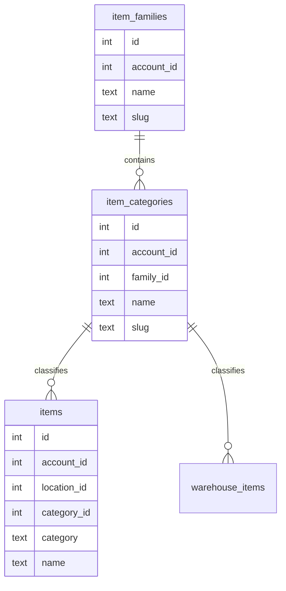

# Item Classification And Query Performance

Date: 2026-05-31

## Current Classification

The current item model has one flat category field:

```text
items.category
warehouse_items.category
```

The VPS test seed currently creates vending-style categories:

- `Beverages`
- `Candy`
- `Chips`
- `Snacks`
- `Pastries`

This is enough for current screens, but it is not a full taxonomy. For example, chips, candy, pastries, and many snack cakes can all roll up into a broader `Snacks` family.

## Performance Goal

For interactive inventory screens, the target should be:

- Direct item lookup by id or barcode: approximately `O(log n)` through indexes.
- Location/category item listing: approximately `O(log n + k)`, where `k` is the number of rows returned.
- UI rendering and voice queues: work only on the selected location/category slice, not the whole database.
- AI/agent context: retrieve a small candidate set first, then ask the model to reason over that subset.

Avoid this pattern as data grows:

```text
Load every item -> filter in JavaScript -> sort in JavaScript -> send to user/AI
```

Prefer this pattern:

```text
Use indexed database filters -> return only the needed rows -> sort with indexed order -> render or send candidates to AI
```

## Indexes Added

Migration:

```text
lib/db/migrations/0009_classification_indexes.sql
```

Indexes:

- `items(account_id, category, name)`
- `items(account_id, location_id, category, name)`
- `warehouse_items(account_id, warehouse_id, category, name)`

These support:

- Count mode by category.
- Restock grouping by category.
- Warehouse category filters.
- AI candidate lookup by location/category.

## Recommended Next Data Model

When the client is ready to lock in product taxonomy, add normalized classification tables:



Example taxonomy:

| Family | Category |
| --- | --- |
| Drinks | Beverages |
| Snacks | Chips |
| Snacks | Candy |
| Snacks | Pastries |
| Snacks | Cookies |
| Frozen | Frozen Meals |
| Frozen | Ice Cream |

Keep the existing text `category` during migration for compatibility, then backfill `category_id`.

## AI And Agent Usage

Agents should not receive full-table inventory dumps. They should request compact indexed views:

- Items below minimum by location/category.
- Overstock by location/category.
- Recent adjustments by item/location.
- Warehouse items below reorder point.
- Candidate item matches by barcode, name prefix, or category.

This keeps model prompts small and response time predictable.

## VPS Test Checks

After migration and seeding, confirm category distribution:

```sql
select category, count(*) as items
from items
group by category
order by category;
```

Confirm location/category distribution:

```sql
select l.name as location, i.category, count(*) as items
from items i
join locations l on l.id = i.location_id
group by l.name, i.category
order by l.name, i.category;
```

Confirm index presence:

```sql
select indexname
from pg_indexes
where schemaname = 'public'
  and indexname in (
    'items_account_category_name_idx',
    'items_account_location_category_name_idx',
    'warehouse_items_account_warehouse_category_name_idx'
  )
order by indexname;
```
