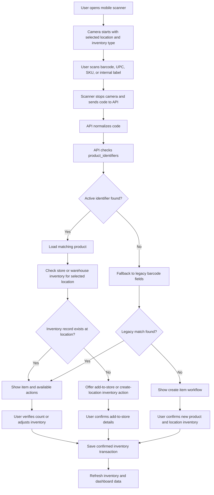

# Mobile Scanner Workflow Design

Date: 2026-06-03

Status: Development implementation

Audience: Business owners, operations leadership, inventory managers, implementation team

## Executive Summary

The mobile scanner workflow lets a user scan a UPC, barcode, vendor code, or internal label from a phone or tablet camera and then update inventory only after the system has identified the product and the user has confirmed the action.

This development pass improves the scanner by separating product identity from location inventory. In plain terms, the app now treats "what the product is" separately from "how much of that product exists at this location." This allows one product to have multiple scannable codes while still keeping counts clean by store, route, or warehouse.

This implementation is intended for the dev environment first. It should not be promoted to the test environment until the database migration, scanner flow, and mobile camera behavior are verified.

## Business Goal

The scanner should make inventory updates faster and safer.

The expected business outcome is:

- A user scans an item on a mobile device.
- KeepTally identifies the product by a normalized identifier.
- The app checks inventory at the selected location.
- The user confirms the intended action.
- The system saves the count, adjustment, add-to-store action, or new item.
- The transaction is visible through inventory history and reporting.

## Current Development Scope

This dev implementation covers:

- Mobile scanner status improvements in the scanner overlay.
- UPC and barcode normalization before lookup.
- Product identity records.
- Product identifier records.
- Store inventory linked to product identity.
- Warehouse inventory linked to product identity.
- Legacy barcode fallback so older test data still works.
- Preflight checks for the new product and identifier indexes.

This pass does not yet complete every future governance workflow, such as manager review queues for duplicate identifiers or full case-to-unit conversion rules.

## Scanner Workflow



## Product Identity Model

The improved model separates three concepts.

| Concept | Meaning | Example |
| --- | --- | --- |
| Product | The actual sellable or countable item | Coke Zero 12 oz |
| Product identifier | A code that can identify the product | UPC, case barcode, vendor SKU |
| Location inventory | The quantity of that product at a location | Coke Zero quantity at Carvana South |

This matters because the same product may have several valid codes. A store may scan the retail UPC, while the warehouse may scan a case label or internal label. Both should resolve to the same product identity while still updating the correct location inventory.

## API Lookup Logic

When the app receives a scanned code, the lookup should follow this order:

1. Normalize the scanned code by removing formatting differences.
2. Search active product identifiers for the current account.
3. If a product identifier match exists, search inventory records by product ID and location.
4. If no product identifier match exists, search legacy barcode fields.
5. If no match exists, guide the user to add the item or create a new product.

This gives the dev environment support for the new UPC model without breaking existing barcode data.

## Mobile User Experience

The mobile scanner should clearly tell the user what state it is in.

Expected states:

- Camera ready.
- Scanning.
- Looking up product.
- Match found.
- No location inventory found.
- Ready to verify or adjust.
- Saving.
- Saved.
- Error or manual entry required.

The dev scanner overlay now includes a small scanner status panel when the mobile scanner feature flag is enabled. That panel helps testers confirm that the scanner is using product identifiers first and legacy barcodes second.

## Save Workflows

### Verify Existing Item

The user scans a known item at the selected location, enters the counted quantity, and confirms the count.

Expected result:

- Quantity is updated if the count changed.
- The item is treated as verified if the count matches.
- Inventory and dashboard data refresh.

### Adjust Existing Item

The user scans a known item and records an adjustment such as damage, spoilage, theft, comp, return, or general correction.

Expected result:

- Quantity changes according to the adjustment.
- Reason and notes are saved.
- Inventory and dashboard data refresh.

### Add Warehouse Product To Store

The user scans an item that exists in warehouse inventory but not at the selected store.

Expected result:

- A store inventory record is created for the selected location.
- The new store record points to the same product identity as the warehouse item.
- The scanned identifier is attached to the product if needed.

### Create New Product And Inventory Record

The user scans an unknown code and chooses to create the item.

Expected result:

- A product record is created or reused.
- A product identifier record is created for the scanned code.
- A location inventory record is created.
- The new item becomes available for future scans.

## Dev Environment Feature Flag

The mobile scanner improvements are controlled with:

```text
VITE_MOBILE_SCANNER_V2_ENABLED=true
```

This is enabled in the VPS dev environment example only. It should remain off in test until dev validation is complete.

## Dev Validation Checklist

Before promotion to test, confirm:

- Mobile browser can access the camera over HTTPS.
- Scanner opens without camera permission failure.
- Manual barcode entry still works if camera access fails.
- Known UPC resolves through `product_identifiers`.
- Existing legacy barcode still resolves through fallback.
- Warehouse item can be added to a store location.
- Unknown UPC can create a new product and inventory record.
- Store and warehouse inventory remain separate after the scan.
- Product identifier indexes are present.
- Preflight passes against the dev database.

## Known Edge Cases

The following cases should be tested before promotion:

- Same UPC attached to more than one product.
- One product with multiple UPCs.
- Case barcode scanned instead of unit barcode.
- Retired or inactive identifier scanned.
- User scans a product that exists in warehouse but not the selected store.
- User scans while the wrong location is selected.
- Camera permission denied.
- Mobile browser blocks camera because the page is not HTTPS.
- Scanner reads the same code repeatedly in a short window.
- Network failure during lookup or save.

## Recommendation

Proceed with dev-only validation first. Once mobile scanning, identifier lookup, inventory save behavior, and preflight checks pass in dev, promote the migration and scanner changes to the test environment for user access testing.
