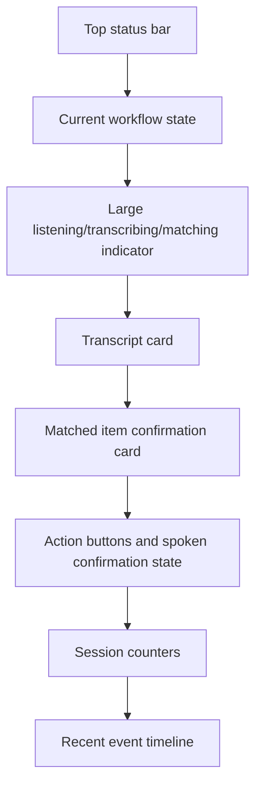
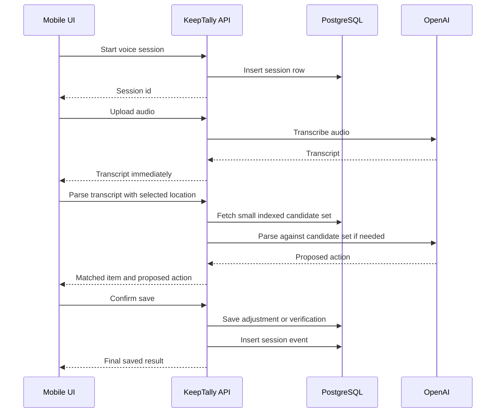

# Mobile Voice Count API Performance Design

Date: 2026-06-03

Status: Proposed

Audience: Business owner, implementation team, test coordinator

## Purpose

This document proposes a faster mobile voice-count workflow for KeepTally. The goal is to make OpenAI transcription, API processing, database lookup, and UI feedback feel immediate and reliable during mobile testing.

The current voice workflow is functional, but mobile users need stronger feedback and faster round trips. A user should always know whether the app is listening, transcribing, matching, confirming, saving, or waiting for the next command.

## Performance Goals

| Workflow step | Target feel | Practical target |
| --- | --- | --- |
| Start voice session | Immediate | Less than 300 ms for UI state change |
| Microphone recording indicator | Immediate | Less than 100 ms after mic opens |
| Audio upload begins | Fast | Immediately after silence, done, stop, or timeout |
| Transcription response | Fast | 1 to 4 seconds depending on audio length and network |
| Item match after transcript | Near immediate | Less than 250 ms for normal test inventory |
| Confirmation prompt | Fast | Less than 1 second after transcript parse |
| Save confirmed count | Near immediate | Less than 500 ms |
| UI status update | Immediate | Optimistic status before server response, final status after save |

The system cannot guarantee sub-millisecond OpenAI response time because transcription depends on network, audio length, and provider latency. The app can, however, make every local and database step fast and keep the UI responsive while OpenAI works.

## Current Mobile Risk Points

Mobile voice count can feel slow or unresponsive when:

- The UI waits silently during transcription.
- The app sends too many candidate items to the parse endpoint.
- Location item lists are loaded broadly instead of by selected location.
- The same location and item data is repeatedly fetched.
- The API performs multiple sequential calls that could be combined or cached.
- The user receives no visible timeline showing which step is active.
- The voice confirmation audio waits on text-to-speech before showing text confirmation.

## Recommended User Interface Layout

Mobile voice count should use a compact command-center layout.



Recommended mobile sections:

| Section | Purpose |
| --- | --- |
| Status bar | Shows `Listening`, `Transcribing`, `Matching`, `Waiting for confirmation`, or `Saved` |
| Transcript card | Shows exactly what OpenAI heard |
| Match card | Shows matched item, location, current quantity, and proposed quantity |
| Confirmation card | Shows what the user needs to say next, such as `Say yes to save` |
| Session counters | Shows verified, updated, skipped, and failed counts |
| Event timeline | Shows the last several voice events for confidence and debugging |

## Recommended API Flow

The API should support a lean voice-count pipeline:



## API Layer Improvements

### 1. Keep Transcription And Saving Separate

The transcription endpoint should only transcribe and return text. It should not save inventory.

Business reason:

- Users need to confirm what was heard before inventory changes.
- This prevents accidental updates from misunderstood speech.

### 2. Return A Step-Level Response Shape

Every voice endpoint should return structured timing and status data.

Example:

```json
{
  "ok": true,
  "requestId": "abc123",
  "step": "transcribed",
  "elapsedMs": 1240,
  "transcript": "coke zero five"
}
```

For parse:

```json
{
  "ok": true,
  "step": "matched",
  "elapsedMs": 180,
  "action": "custom",
  "itemId": 42,
  "itemName": "Coke Zero",
  "currentQuantity": 3,
  "proposedQuantity": 5,
  "requiresConfirmation": true
}
```

### 3. Add A Server-Side Candidate Endpoint

The mobile UI should not send a large item list to `/api/voice/parse`. The API should accept transcript and location, then fetch a small candidate set internally.

Recommended endpoint:

```text
POST /api/voice/match
```

Input:

```json
{
  "sessionId": 123,
  "locationId": 5,
  "transcript": "coke zero five"
}
```

API responsibilities:

- Normalize the transcript.
- Extract quantity locally when possible.
- Query indexed item candidates by account, location, category, barcode, and name.
- Send only the best candidates to OpenAI when local matching is not confident.
- Return the proposed action to the UI.

Business benefit:

- Smaller payloads.
- Faster parse calls.
- Less AI token usage.
- Better consistency between browser and server.

### 4. Avoid Sending Full Item Lists To OpenAI

OpenAI should receive only a focused candidate list.

Preferred candidate set:

```text
Selected account + selected location + top 20 to 50 item candidates
```

Avoid:

```text
Every item in the database
```

This keeps cost, latency, and error risk lower.

## Database Optimization

### Current Fast Path

The API should use indexed lookups first:

- Account id.
- Location id.
- Item name.
- Category.
- Barcode or future product identifier.

Recommended lookup order:

1. Exact barcode or product identifier match.
2. Exact normalized item name match within location.
3. Prefix match within location.
4. Fuzzy candidate match within a small location-scoped set.
5. OpenAI parse only when the local match is uncertain.

### Recommended Indexes

The current database already includes several lookup indexes. For mobile voice performance, the important ones are:

```text
items(account_id, location_id, name)
items(account_id, location_id, category, name)
items(account_id, barcode)
warehouse_items(account_id, warehouse_id, category, name)
```

Future product identifier indexes:

```text
product_identifiers(account_id, normalized_code)
product_identifiers(account_id, product_id)
store_inventory(account_id, product_id, location_id)
```

### Complexity Target

The goal is not to scan all items. The goal is:

```text
O(log n + k)
```

Where:

- `n` is total item count.
- `k` is the small number of candidate rows returned.

The UI and AI should work against `k`, not the full database.

## Caching Strategy

### Short-Lived API Cache

Cache stable, frequently used voice-count data for a short time:

| Cache item | Suggested TTL | Reason |
| --- | --- | --- |
| Active locations by account | 30 to 60 seconds | Avoid repeated location lookups |
| Items by account/location | 15 to 30 seconds | Speed repeated voice sessions |
| Category summaries | 30 to 60 seconds | Help agent and dashboard views |
| AI status result | 10 to 30 seconds | Avoid repeated model checks |

Do not cache:

- Confirmed inventory writes.
- User permissions.
- Session event inserts.
- Admin-sensitive access decisions.

### Client Cache

The mobile UI can keep selected location inventory in memory while the voice session is active.

Refresh after:

- A save.
- A location change.
- A manual reload.
- A session restart.

## UI Feedback Requirements

The mobile UI should show a visible state for every phase:

```text
Ready
Requesting microphone
Listening
Transcribing
Matching item
Waiting for confirmation
Saving
Saved
Skipped
Failed
```

Each state should update immediately. Even if OpenAI takes several seconds, the user should see that the system is working.

## Voice Confirmation Behavior

The app should not save inventory until the user confirms.

Accepted confirmation examples:

- `yes`
- `confirm`
- `correct`
- `affirmative`
- `that is right`
- `save it`

Rejected or retry examples:

- `no`
- `wrong`
- `cancel`
- `try again`
- `skip`

If unclear:

- Do not save.
- Ask the user to confirm again.
- Show the interpreted transcript on screen.

## Recommended Implementation Order

### Phase 1: Observability And UI Feedback

- Add timing metadata to voice transcribe, parse, speak, and save responses.
- Show step timing in the mobile voice debug timeline.
- Improve failure messages so users know whether the issue is microphone, transcription, parsing, TTS, or saving.

### Phase 2: Server-Side Candidate Matching

- Add `/api/voice/match`.
- Move candidate selection from the browser into the API.
- Limit OpenAI parse input to top candidates.
- Keep local deterministic parsing as the first pass.

### Phase 3: Short-Lived API Cache

- Add account/location cache for voice-count item candidates.
- Invalidate cache after inventory writes.
- Keep TTL short to avoid stale count behavior.

### Phase 4: Mobile UI Refinement

- Add compact transcript and match cards.
- Add step-by-step visual status.
- Add visible confirmation prompt.
- Add a recent event timeline.

### Phase 5: Product Identifier Integration

- Use product identifiers for barcode and UPC matching.
- Support multiple UPCs, case codes, vendor SKUs, and internal labels.
- Keep AI matching focused on product identity, not raw item-table guessing.

## Acceptance Criteria

This design should be considered successful when:

- A mobile user sees immediate feedback after pressing start.
- A transcript appears as soon as OpenAI returns text.
- A matched item appears before saving.
- The app waits for a clear affirmative confirmation before saving.
- The save result updates session counters immediately.
- Voice endpoint logs include timing for transcription, parse, TTS, and save.
- The API does not send full inventory lists to OpenAI.
- Database lookups remain location-scoped and indexed.

## Business Recommendation

Proceed with Phase 1 and Phase 2 first.

Those phases provide the best immediate improvement for mobile testing: faster perceived performance, clearer user feedback, and lower AI latency/cost risk. Caching and product identifier work should follow once the mobile voice workflow is stable and measurable.

