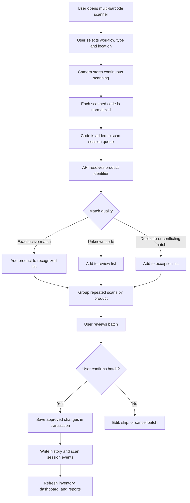

# Multi-Barcode Scanner Future Design

Date: 2026-06-03

Status: Future implementation proposal

Audience: Business owners, operations leadership, inventory managers, implementation team

## Executive Summary

KeepTally should support multi-barcode scanning as a future enhancement to the current mobile scanner workflow. The goal is to let users scan several products in one continuous session, review the matched items, confirm quantities or actions, and then save the batch safely.

This is different from the current single-scan workflow. The current workflow scans one code, performs one lookup, and guides the user through one action. A multi-barcode workflow would collect several scans first, group duplicate scans, detect conflicts, and then present a review screen before any inventory changes are saved.

## Business Goal

The multi-barcode scanner should reduce repetitive field work during inventory counts, warehouse receiving, and store restocking.

The intended user outcome is:

- Scan multiple items quickly.
- See what was recognized.
- See what needs attention.
- Confirm the batch.
- Save all approved changes together.
- Keep a complete audit trail.

## Recommended Use Cases

### Store Cycle Count

A store user scans items on a shelf and records physical counts.

Expected result:

- Each scanned product is matched to the selected store location.
- Duplicate scans are grouped.
- The user enters or confirms final counts.
- The system records verified, updated, skipped, and exception items.

### Warehouse Receiving

A warehouse user scans cases or units during receiving.

Expected result:

- Each barcode resolves to a product identifier.
- Case barcodes can apply unit multipliers when configured.
- Received quantities update warehouse inventory.
- Unknown vendor codes are captured for review.

### Store Restock From Warehouse

A user scans products being moved from warehouse inventory into a store location.

Expected result:

- Warehouse inventory is reduced.
- Store inventory is increased.
- Transfer history shows source, destination, user, product, and scanned identifier.

### Unknown Barcode Review

A user scans codes that are not yet registered.

Expected result:

- Unknown codes are not silently discarded.
- The app groups unknown codes into a review list.
- A manager can attach the code to an existing product or create a new product.

## Target Workflow



## Recommended Data Model Additions

The current product identity model is a strong foundation. Future multi-barcode scanning should build on it with scan session tables.

| Table | Purpose |
| --- | --- |
| `scan_sessions` | One scanning session for one user, location, and workflow type |
| `scan_session_events` | Each raw scan, match result, and user decision |
| `scan_session_items` | Grouped product-level results for the batch |
| `product_identifiers` | Existing UPC, SKU, case barcode, or internal label mapping |
| `items` | Store location inventory records |
| `warehouse_items` | Warehouse inventory records |

## Session States

Recommended scan session states:

- `active`
- `reviewing`
- `saving`
- `completed`
- `cancelled`
- `failed`

Recommended scan event states:

- `matched`
- `unknown`
- `duplicate`
- `conflict`
- `skipped`
- `saved`
- `failed`

These states make it easier to recover from network interruptions, user cancellation, or partial failures.

## API Design

Recommended future endpoints:

```text
POST /api/scan-sessions
POST /api/scan-sessions/:id/events
GET  /api/scan-sessions/:id
POST /api/scan-sessions/:id/confirm
POST /api/scan-sessions/:id/cancel
```

### `POST /api/scan-sessions`

Creates a new scanner session.

Required fields:

- Account context from authentication.
- User ID from authentication.
- Location or warehouse.
- Workflow type.

### `POST /api/scan-sessions/:id/events`

Adds one or more scanned codes to the session.

The endpoint should accept a small batch of scans so the mobile client does not need to make one request per camera frame.

### `POST /api/scan-sessions/:id/confirm`

Saves the approved batch.

This endpoint should use a database transaction. If the batch cannot be saved safely, the API should return a clear error and leave the session available for review.

## Mobile User Experience

The mobile screen should show:

- A live camera view.
- Current location.
- Count of scanned items.
- Count of matched items.
- Count of unknown or exception items.
- Recent scan feedback.
- A review button.
- A pause button.
- A finish button.

The scanner should avoid noisy UI updates for every camera frame. It should only update when a new code is accepted into the scan session.

## Duplicate Scan Handling

Duplicate scan handling should be intentional.

Recommended rules:

- Ignore the same code if scanned repeatedly within a short cooldown window.
- Count duplicate scans if the workflow is receiving or transfer-based.
- Group duplicate scans by product for review.
- Let the workflow define whether duplicates mean "same product scanned again" or "quantity increased."

Example:

- Cycle count: duplicate scan should not automatically increase quantity.
- Warehouse receiving: duplicate case scan may increase received quantity.

## Conflict Handling

The system should not update inventory automatically when a scanned code is ambiguous.

Conflict examples:

- One normalized code maps to multiple active products.
- The code is retired.
- The code belongs to a case barcode but no unit multiplier is configured.
- The product exists but is not assigned to the selected location.
- The user lacks access to the location.

Recommended behavior:

- Put the scan into an exception list.
- Show a clear reason.
- Require user or manager review.

## Performance Recommendations

To keep the mobile workflow fast:

- Normalize codes client-side for display and server-side for trust.
- Batch scan events in small groups.
- Use indexed lookup on `product_identifiers(account_id, normalized_code)`.
- Cache active location and product candidate data for short periods.
- Debounce repeated camera reads.
- Avoid long-running writes until the user confirms the batch.

## Acceptance Criteria

This future feature should be considered ready when:

- A user can scan multiple codes in one session.
- Duplicate scans are grouped correctly.
- Unknown scans are captured for review.
- Conflicting scans do not change inventory automatically.
- Confirmed batches save inside a database transaction.
- Inventory history shows the scanned identifier used for each saved change.
- Mobile camera scanning works over HTTPS.
- A lost connection does not lose the entire scan session.

## Recommendation

Build this as a Phase 2 scanner enhancement after the current dev scanner and product identifier migration are validated. The first implementation should support one workflow type, preferably store cycle count, before expanding to receiving and transfer workflows.
