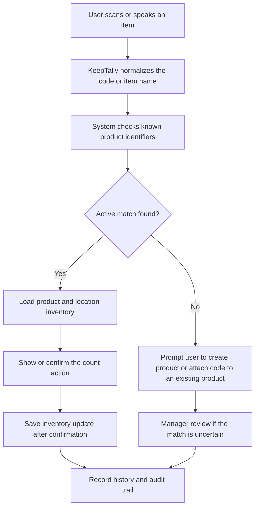

# Change Request: Product Identifier and UPC Lifecycle Management

Date: 2026-06-01

Status: Proposed

Audience: Business owners, operations leadership, inventory managers, implementation team

## Executive Summary

KeepTally currently treats an item barcode as a single field on an inventory record. That works for a prototype, but it does not fully match how real inventory behaves.

In live operations, one product may have several valid ways to identify it:

- A retail UPC.
- A case barcode.
- A vendor SKU.
- An internal warehouse label.
- A replacement UPC after packaging changes.
- A retired or duplicate barcode that still appears in the field.

This change request proposes separating the product from the codes used to identify it. The goal is to make scanning, voice counts, warehouse receiving, store counts, and reporting more reliable as the system grows.

## Business Problem

The current design can create confusion when different barcodes point to the same product, or when one barcode is reused, replaced, or scanned at the wrong location.

Common business examples include:

- A beverage has one UPC for a single bottle and another barcode for a case.
- A snack item changes packaging but remains the same sellable product.
- A warehouse label is created for internal use, while the store still scans the retail UPC.
- A vendor SKU appears on invoices but does not match the consumer-facing barcode.
- A scanner reads an old code that should no longer update inventory automatically.

If KeepTally keeps only one barcode per item record, these cases become harder to audit and easier to miscount.

## Current State

The current app stores barcode-style values directly on inventory records.

In plain terms:

- The item record says what the item is.
- The same record also says where the item is.
- The same record also stores the barcode.
- Scan history stores the scanned code, but not the full lifecycle of that code.

This is workable during testing, but it is not ideal for long-term accuracy, reporting, or AI-assisted inventory workflows.

## Proposed Change

KeepTally should use a more business-aligned structure:

| Business concept | Plain-English meaning |
| --- | --- |
| Product | What the item actually is, such as Coke Zero 12 oz or Skittles Original |
| Identifier | Any code used to recognize the product, such as UPC, SKU, case code, or internal label |
| Inventory | How much of the product exists at a store, warehouse, route, or other location |
| History | What happened to the product, when it happened, and who performed the action |

This keeps product identity clean while allowing many valid codes to point to the same product.

## Target Workflow

## Business Workflow Details

1. A user scans a barcode, enters an item, or speaks an item during voice count mode.
2. KeepTally cleans the input into a standard format.
3. The system checks the product identifier list first.
4. If one active match is found, the app loads the matching product and the correct location inventory.
5. If the product exists but is not stocked at that location, the app can offer to add it to that location with approved defaults.
6. If the code is warehouse-only, the app can offer a warehouse transfer or store stocking workflow.
7. If no match is found, the user can create a new product or request manager review.
8. If multiple possible matches exist, the system should not update inventory automatically. It should place the scan into a review state.
9. Every accepted, rejected, retired, or reassigned identifier should be logged.

## Operational Benefits

This change improves KeepTally in several practical ways:

- Fewer failed scans when products have multiple valid codes.
- Better support for warehouse cases, store units, vendor SKUs, and internal labels.
- Cleaner reporting because products are tracked separately from their barcodes.
- Better audit history when a code is added, retired, or reassigned.
- More reliable AI voice count behavior because the AI can match against known product identifiers instead of guessing from item names alone.
- Faster lookup behavior as the database grows because product identifier searches can be indexed directly.

## AI And Agent Benefits

The AI layer becomes more useful when product identity is structured clearly.

With this change, AI agents can:

- Match spoken item names to the right product more accurately.
- Detect when a scanned UPC belongs to a case instead of a single unit.
- Ask for confirmation when a code is unknown or ambiguous.
- Suggest cleanup when duplicate or retired codes are still being used.
- Report products that have inventory but no active barcode.
- Identify products with too many similar names or incomplete label data.

The AI should not be allowed to make final inventory changes from an uncertain match. It should recommend, ask for confirmation, or route the item for review.

## Recommended Implementation Phases

### Phase 1: Add Identifier Support Without Breaking Current Screens

Add product identifier records while keeping the current item screens working.

Recommended work:

- Add a product identity layer.
- Add a product identifier layer.
- Backfill products from current item and warehouse records.
- Keep existing barcode fields temporarily for compatibility.
- Update scan lookup to check identifiers first, then fall back to current barcode fields.
- Add audit records when identifiers are created, retired, or reassigned.

Business result:

KeepTally gains multi-UPC support without forcing a disruptive redesign of every screen at once.

### Phase 2: Improve Store And Warehouse Inventory Relationships

Separate product identity from location inventory.

Recommended work:

- Store inventory by product and location.
- Warehouse inventory by product and warehouse.
- Keep minimum and maximum stock ranges at the inventory-location level.
- Support case-to-unit conversion where appropriate.

Business result:

The same product can be tracked cleanly across stores, routes, warehouses, and receiving workflows.

### Phase 3: Add Review And Governance Tools

Give operations a safe way to manage questionable codes.

Recommended work:

- Add a review queue for unknown or conflicting codes.
- Add screens for attaching a new UPC to an existing product.
- Add status values such as active, retired, duplicate review, and blocked.
- Add manager approval for risky identifier changes.

Business result:

The system becomes safer for field use because uncertain scans do not silently alter inventory.

### Phase 4: AI-Assisted Cleanup And Recommendations

Use AI agents to monitor identifier health.

Recommended work:

- Flag products with no active barcode.
- Flag barcodes attached to multiple products.
- Flag repeated unknown scans.
- Suggest item merges where names and categories are highly similar.
- Summarize identifier issues by location and priority.

Business result:

Managers receive practical cleanup recommendations instead of having to inspect raw data manually.

## Acceptance Criteria

This change should be considered successful when:

- A product can have more than one active identifier.
- A barcode scan can resolve to the correct product quickly.
- A case barcode can be distinguished from an each-unit barcode.
- A retired barcode does not update inventory without review.
- Unknown barcodes are captured for review instead of being lost.
- Inventory history shows which identifier was used for the transaction.
- Voice count mode can use identifiers to improve item matching.
- Reports can show product-level inventory even when multiple codes exist.

## Risks If We Do Nothing

If the current single-barcode model remains in place, the business may run into:

- More manual corrections.
- Confusing scan results.
- Inaccurate counts when case and unit codes are mixed.
- Weak audit history around barcode changes.
- Harder onboarding for new customers with messy inventory data.
- Lower trust in AI-assisted counting because item matching will remain too dependent on names alone.

## Business Decisions Needed

Before implementation, the business should confirm:

- Which identifier types matter first: UPC, SKU, internal label, case barcode, or vendor code.
- Whether case barcodes should automatically convert to unit quantities.
- Who is allowed to add or retire product identifiers.
- Whether unknown scans should create draft products or go to review only.
- Whether every product must have at least one active identifier before production use.

## Recommendation

Proceed with Phase 1 first.

Phase 1 gives KeepTally the most important improvement with the lowest operational disruption. It supports multiple UPCs and better scan matching while allowing the existing inventory screens to continue working during the transition.

This is a strong foundation for future warehouse receiving, store counts, AI voice workflows, label generation, and audit-ready reporting.
