# KeepTally Routing and Use-Case Workflows

Generated: 2026-05-30

This document summarizes application routing and diagrams the major use cases that should be tested before the VPS test environment is considered ready for user access testing.

## Routing Overview

KeepTally has two routing layers:

1. Browser/page routing handled by the React app with Wouter.
2. API routing handled by Express under `/api`.

The API server also serves the built React frontend. Non-API `GET` requests return the frontend `index.html`, allowing direct browser access to routes like `/inventory`, `/voice-check`, and `/admin/users`.

## Frontend Routes

| Route | Page | Access |
| --- | --- | --- |
| `/login` | Login | Public |
| `/change-password` | Password change | Authenticated user with a required password change |
| `/` | Dashboard | Protected |
| `/inventory` | Store inventory | Protected |
| `/restock` | Transfers/restock | Protected |
| `/history` | Reports/history | Protected |
| `/voice-check` | Voice inventory | Protected |
| `/orders` | Pick lists/orders | Protected |
| `/orders/:id` | Order detail | Protected |
| `/orders/:id/print` | Printable order | Protected |
| `/route-sheets` | Route sheets | Protected |
| `/import` | Store inventory import | Protected |
| `/scan` | Barcode scanner | Protected |
| `/warehouse` | Warehouse inventory | Protected |
| `/warehouse/:id` | Warehouse item detail | Protected |
| `/warehouse/voice` | Warehouse voice mode | Protected |
| `/warehouse/purchases` | Warehouse purchases | Protected |
| `/admin/users` | Users and permissions | Protected, admin UI |
| `/settings` | Settings | Protected |

Protected route behavior:

- If auth is still loading, the app shows a loading state.
- If unauthenticated, the user is redirected to `/login`.
- If authenticated but `mustChangePassword` is true, the user is redirected to `/change-password`.
- Otherwise, the target page renders.

## API Route Groups

Public or semi-public:

| API | Purpose |
| --- | --- |
| `GET /api/healthz` | App health check |
| `GET /api/ai/status` | AI configuration status |
| `GET /api/ai/connectivity` | AI endpoint connectivity check |
| `POST /api/auth/login` | Login |

Authenticated:

| API Group | Purpose |
| --- | --- |
| `/api/auth/me` | Current user session |
| `/api/auth/logout` | Logout |
| `/api/auth/change-password` | Change password |
| `/api/users` | Admin user management |
| `/api/permissions` | Admin permission matrix |
| `/api/locations` | Location list |
| `/api/items` | Store inventory |
| `/api/history` | History/reporting |
| `/api/dashboard/*` | Dashboard summaries |
| `/api/command` | Natural-language inventory command |
| `/api/restock*` | Restock lists and CSV |
| `/api/orders*` | Orders/pick lists |
| `/api/route-sheets*` | Route sheet workflow |
| `/api/import/*` | Store inventory import |
| `/api/scan/*` | Scanner workflow |
| `/api/warehouse*` | Warehouse inventory, purchases, transfers, import/export |
| `/api/voice/*` | Voice parse, transcription, speech |

Authorization rules:

- Most API routes require a valid `kt_token` cookie or bearer token.
- Account-scoped routes require active account context and active membership.
- Feature routes require permission checks such as `edit_store_inventory`, `scan_barcodes`, `use_voice_mode`, `view_warehouse`, `edit_warehouse`, `receive_purchases`, and `transfer_inventory`.

## Route-Level Notes

- `/api/auth/login` is a `POST` endpoint. Opening it directly in a browser with `GET` can return `Authentication required` or other non-login output. The browser login page is `/login`.
- On the VPS from a Mac browser, use `http://2.25.143.61:3000/login`. `127.0.0.1` in the Mac browser means the Mac, not the VPS.
- The layout location selector currently uses a hardcoded frontend location list, while some pages load locations from `/api/locations`. This should be normalized so all location selectors are database-driven.

## Use Case 1: Login and Forced Password Change

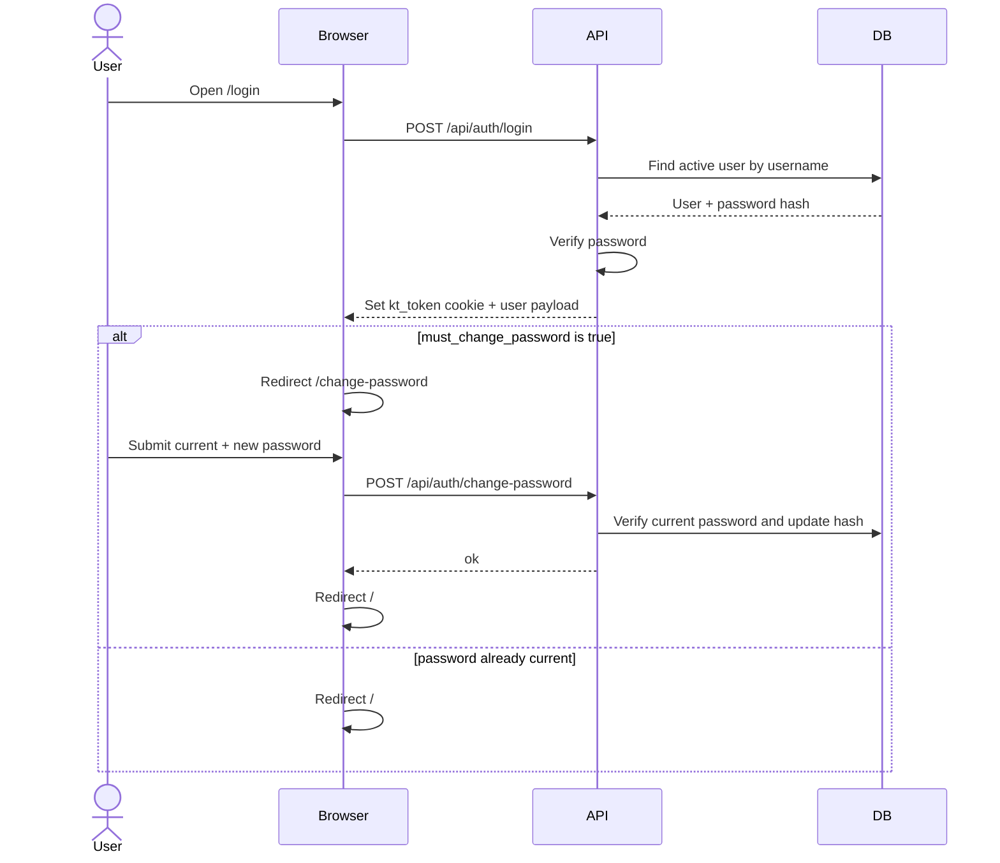

Validation points:

- Login returns `200`.
- Cookie is set with `HttpOnly` and `SameSite=Lax`.
- Wrong password returns `401`.
- Missing username/password returns `400`.
- First admin is forced through password change.
- After password change, `must_change_password` is false.

## Use Case 2: Admin User and Permission Management

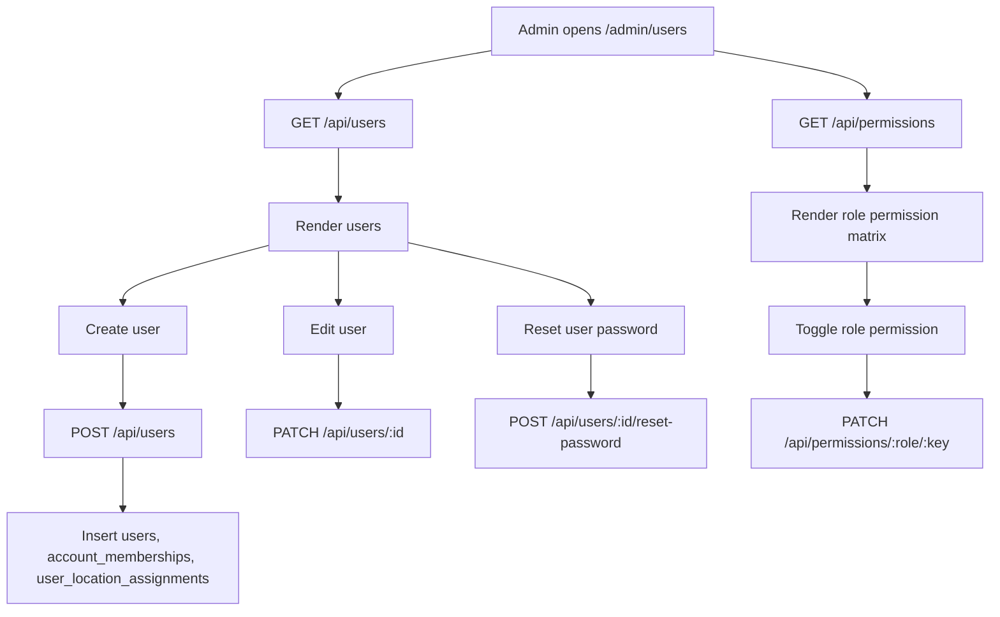

Validation points:

- Only admin/account-admin access should reach this page successfully.
- User creation validates username, password, role, and locations.
- Permission changes affect subsequent access.
- User location assignments stay aligned with assigned locations.
- Admin cannot accidentally lose all access during testing.

## Use Case 3: Dashboard Review

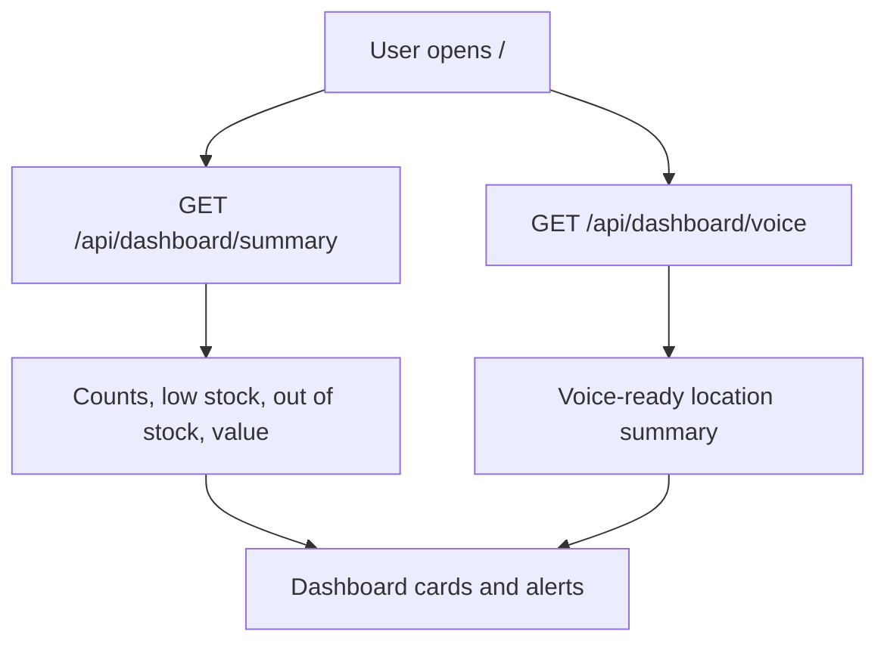

Validation points:

- Dashboard loads after login.
- Location filter changes summary query.
- Alert count points user toward inventory.
- Empty database state is handled gracefully.

## Use Case 4: Store Inventory Browse and Edit

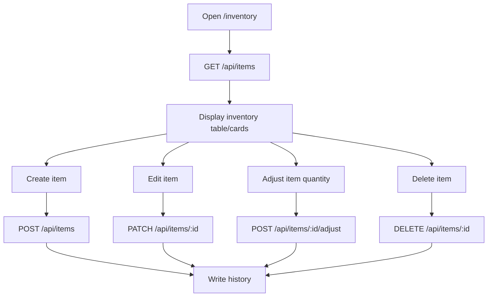

Validation points:

- Item list uses account/location scope.
- Barcode lookup works.
- Duplicate item/barcode edge cases are visible in preflight.
- Quantity and par levels cannot drift negative.
- Mutations write `history`.

## Use Case 5: Store Import

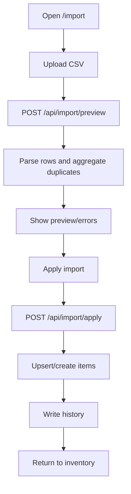

Validation points:

- Missing required columns are rejected.
- Duplicate barcode quantities aggregate correctly.
- Bad quantities normalize safely.
- Import respects location permissions.
- Applied import creates or updates items and history.

## Use Case 6: Barcode Scan Workflow

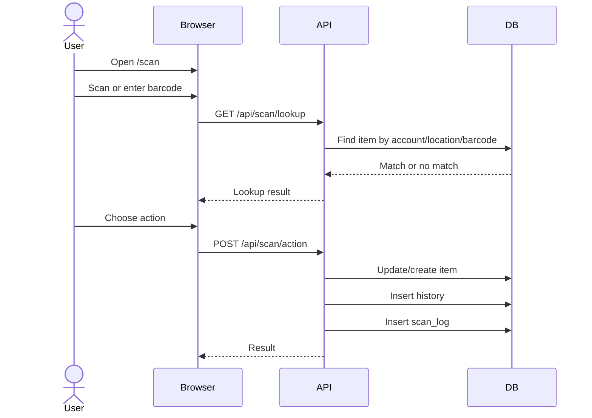

Validation points:

- Known barcode resolves quickly.
- Unknown barcode can create item when allowed.
- Scan log records action.
- Location permission is enforced.
- Repeated barcode scans do not create unintended duplicates.

## Use Case 7: Voice Inventory

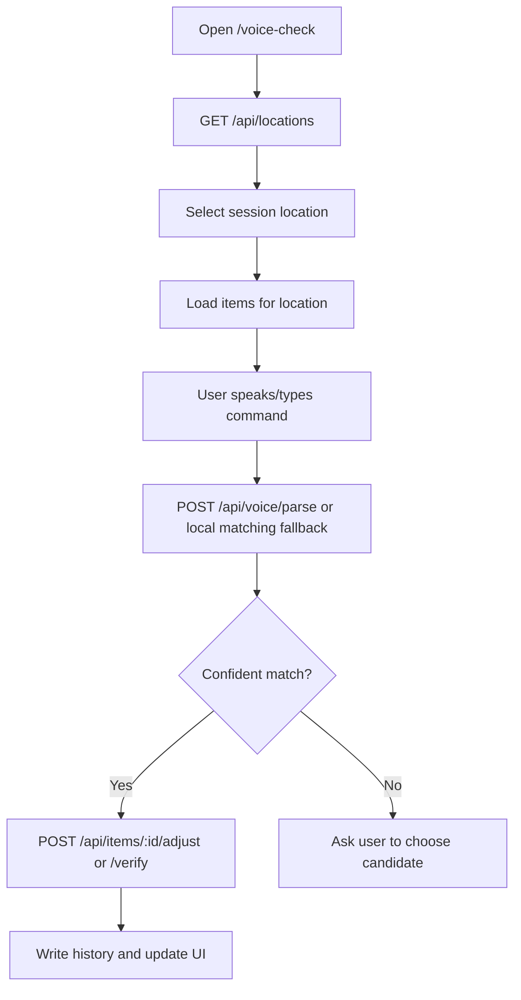

Validation points:

- Next/start button requires location and loaded data.
- AI unavailable falls back to local matching.
- Ambiguous items ask for confirmation.
- Quantity commands and verification commands write expected records.
- Voice mode respects `use_voice_mode` permission.

## Use Case 8: Orders/Pick Lists

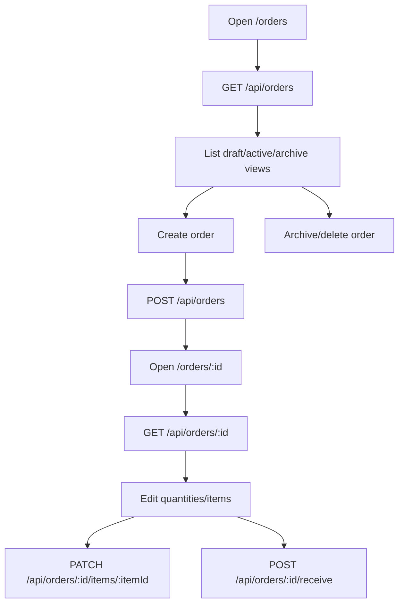

Validation points:

- Orders are account/location scoped.
- Soft delete/archive behaves as expected.
- Receiving updates the related inventory correctly.
- Print route `/orders/:id/print` loads.

## Use Case 9: Route Sheets

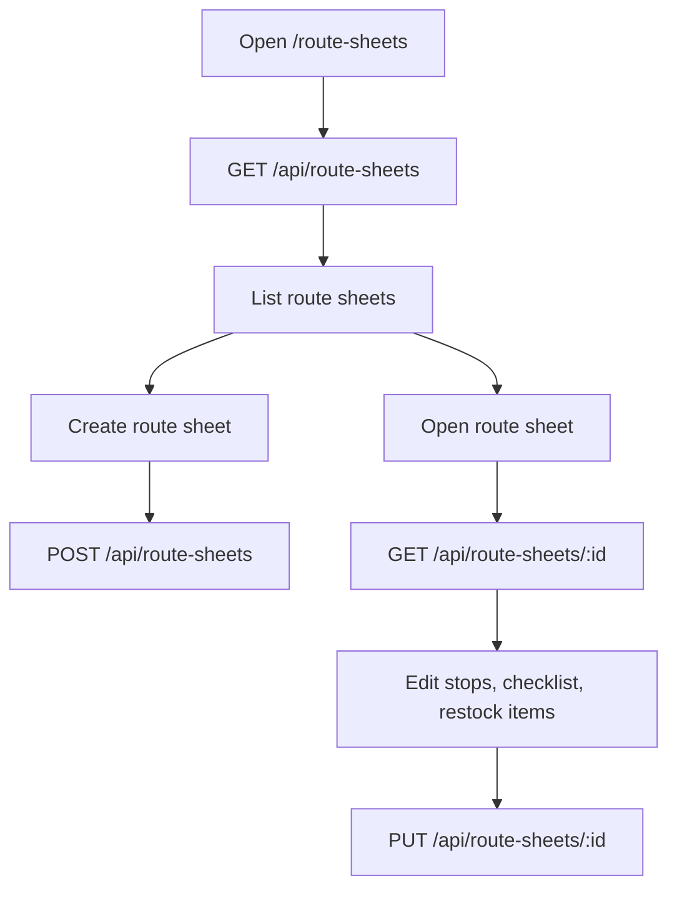

Validation points:

- Route date/status filters work.
- Stops preserve route order.
- Stop items connect back to inventory where possible.
- No delete endpoint currently exists for route sheets; this is a known workflow gap.

## Use Case 10: Warehouse Inventory

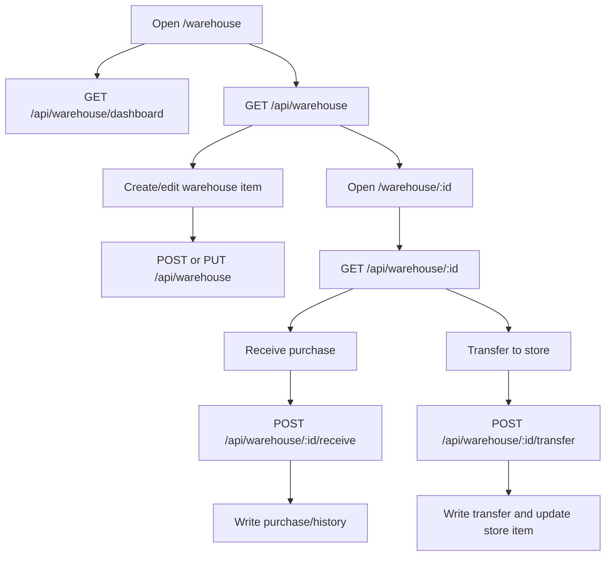

Validation points:

- Warehouse pages require warehouse permissions.
- Purchase receiving updates cost and quantity.
- Transfer writes warehouse transfer and store inventory changes.
- Export/reorder CSV endpoints download.

## Use Case 11: Warehouse Voice

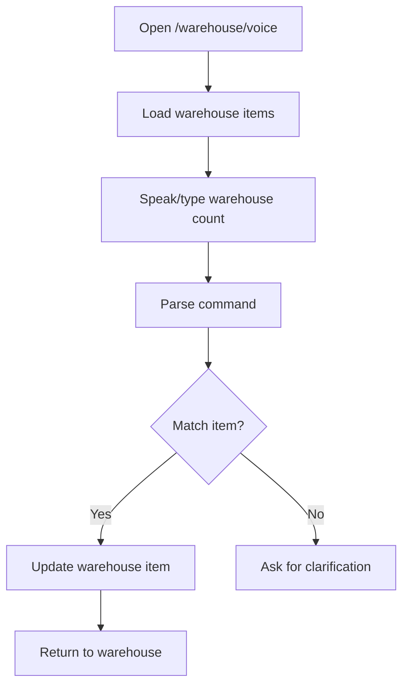

Validation points:

- Local matching works without remote AI.
- Ambiguous warehouse items ask for confirmation.
- Quantity updates remain non-negative.
- Warehouse permissions are enforced.

## Use Case 12: Reports and History

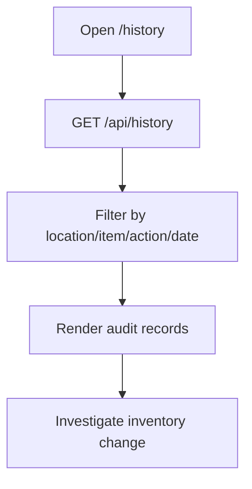

Validation points:

- Recent history loads fast.
- Location filters use normalized location where possible.
- Item-level history works after Phase 1 indexes.
- Seed/import/scan/adjust actions are distinguishable.

## Use Case 13: Settings

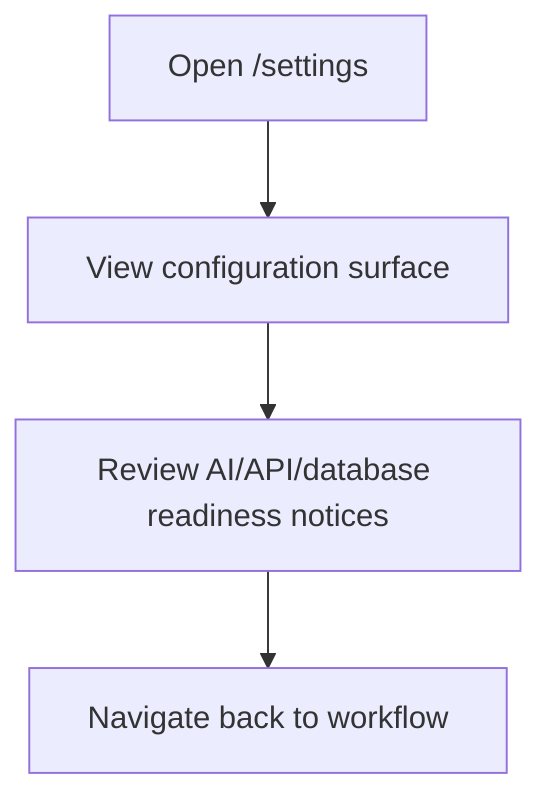

Validation points:

- Page is protected.
- Settings state does not expose secrets.
- Any future settings writes should be permission-gated.

## Use Case 14: Logout

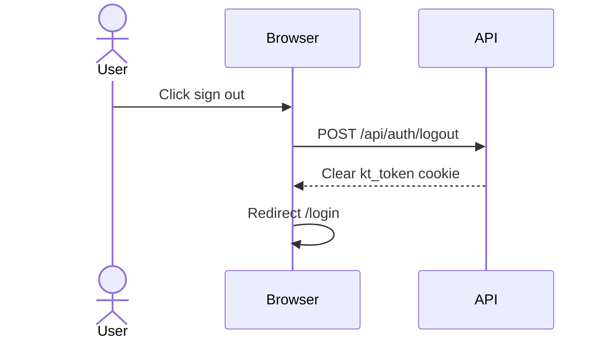

Validation points:

- Cookie is cleared.
- `/api/auth/me` returns `401` after logout.
- Protected routes redirect to `/login`.

## Preflight Coverage Recommendations

Already present or added:

- DB connection.
- Migration files.
- Required relational indexes.
- Seed data counts.
- Relational orphan checks.
- Missing normalized location checks.
- Duplicate/negative inventory edge cases.
- Active admin user.
- Active admin membership.
- Complete admin permission matrix.
- Unsupported roles and duplicate usernames.

Recommended next API-level preflight:

- Login with configured test admin credentials.
- Verify `/api/auth/me`.
- Verify `/api/users` as admin.
- Verify `/api/permissions` as admin.
- Verify logout clears session.
- Verify wrong password returns `401`.

The existing `scripts/dev-smoke.mjs` already covers basic login and `/auth/me`. A good Phase 2 hardening step is to add a VPS-oriented auth/admin smoke script that tests the full admin workflow against the running container.

## Testing Checklist

Before user access testing:

- Run migrations.
- Seed 600-item VPS test inventory.
- Run deploy preflight.
- Run API smoke test.
- Log in from browser.
- Change admin password.
- Verify each page route loads.
- Run through one create/edit/delete or create/edit/archive path per workflow.
- Confirm history and scan logs reflect actions.
- Confirm role/permission restrictions with a non-admin test user.
