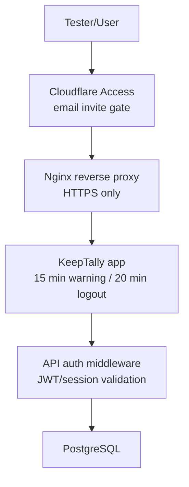

# Session Inactivity and AI Capacity Design

This document proposes a secure session timeout model for KeepTally and a capacity plan for medium-to-heavy AI usage. The goal is to protect test users, avoid abandoned authenticated sessions, and keep voice/AI workflows responsive under concurrent use.

## Recommended Session Policy

Use a two-step inactivity policy inside KeepTally:

```text
15 minutes idle: show warning
20 minutes idle: automatically log out
```

The warning should tell the user they will be signed out in 5 minutes and provide a "Stay signed in" action. Any real user activity should reset the timer.

Tracked activity:

- Mouse movement.
- Keyboard input.
- Click/touch events.
- Scroll events.
- Voice workflow start/stop.
- Successful API workflow actions.

Do not reset the timer from passive background polling alone. Otherwise, dashboard refreshes could keep a stale session alive forever.

## App-Level Versus VPS-Level Control

### App-Level Timeout

This should be the primary enforcement point.

Pros:

- Knows the current user and account.
- Can show a warning modal before logout.
- Can call `POST /api/auth/logout` cleanly.
- Can clear local UI state and redirect to `/login`.
- Can avoid interrupting an active voice count by treating active recording as user activity.

Cons:

- Requires frontend code and server session support.
- Must be tested across every route.

### Cloudflare Access / Reverse Proxy Timeout

This should be the outer gate for the test environment.

Pros:

- Protects the entire test site before KeepTally even loads.
- Good for invite-only UAT.
- Can require email approval or one-time pin.

Cons:

- Does not understand KeepTally workflows.
- May redirect or expire in the middle of a request.
- Does not replace app logout because KeepTally still has its own cookie.

### VPS-Level Global Timeout

A VPS-level timeout is useful for SSH/Webuzo/admin panels, but it should not be the main web app policy.

Pros:

- Good for admin shells and control panels.
- Central security posture for server operators.

Cons:

- It cannot reliably show a KeepTally-specific warning.
- It may not know whether a browser session is actively doing voice work.
- It is not portable if the app later moves to another host.

## Recommended Layering



Use all three layers, but with different responsibilities:

| Layer | Responsibility |
| --- | --- |
| Cloudflare Access | Controls who can reach the test environment. |
| Nginx/VPS | Handles HTTPS, proxying, and public exposure. |
| KeepTally app | Handles workflow-aware inactivity logout. |
| API auth middleware | Rejects expired or invalid sessions. |

## Frontend Implementation Design

Add a global `SessionInactivityProvider` inside the authenticated app shell.

Responsibilities:

- Watch user activity events.
- Track `lastActiveAt`.
- Show warning modal after 15 minutes.
- Auto-call `logout()` after 20 minutes.
- Reset timer when user clicks "Stay signed in".
- Pause auto-logout only for explicit active workflows, such as an ongoing voice recording, then resume afterward.

Suggested config:

```ts
const IDLE_WARNING_MS = 15 * 60 * 1000;
const IDLE_LOGOUT_MS = 20 * 60 * 1000;
const ACTIVITY_THROTTLE_MS = 10 * 1000;
```

Suggested events:

```ts
["mousemove", "mousedown", "keydown", "touchstart", "scroll", "visibilitychange"]
```

The timer should be throttled so normal mouse movement does not trigger excessive React state updates.

## Backend Session Design

The current app uses a JWT cookie with a 7-day expiration. That is fine for "remember me" style sessions, but it does not enforce inactivity by itself.

Recommended next step:

- Keep JWT cookie for now.
- Add app-level inactivity logout immediately.
- Later add server-side session tracking if stricter audit requirements appear.

Future server-side hardening:

```text
sessions
- id
- account_id
- user_id
- token_hash
- created_at
- last_seen_at
- expires_at
- revoked_at
- ip_address
- user_agent
```

With server-side sessions, the API can reject requests when `last_seen_at` is older than the allowed inactivity window. This is stricter than frontend-only logout.

## User Experience

Warning modal copy:

```text
You have been inactive for 15 minutes.
For security, KeepTally will sign you out in 5 minutes.
```

Actions:

- `Stay signed in`
- `Sign out now`

If the user is in voice count mode:

- Show the warning only when recording is not active.
- If recording is active, treat microphone activity as user activity.
- If transcription or save is in progress, finish the current request before redirecting.

## AI Capacity Design

KeepTally should treat AI calls as a bounded service, not an unlimited background resource.

### Core Controls

- Per-account AI usage tracking.
- Per-user request throttling.
- Per-workflow timeout limits.
- Queue or reject excess background agent jobs.
- Retry only when safe and only with small limits.
- Do not retry inventory write operations blindly.

### Recommended Timeouts

| Workflow | Timeout target | Notes |
| --- | ---: | --- |
| Voice transcription | 10-15 seconds | Audio should be short and compressed. |
| Voice parse | 5-8 seconds | Should be a small structured-output call. |
| Voice speech | 10-15 seconds | Cache common prompts later. |
| Agent insight job | 30-120 seconds | Should run async/background. |
| Dashboard AI summary | 10-20 seconds | Prefer cached rollups. |

### Concurrency Model

Use independent limits by workflow:

```text
voice_transcription: high priority, small concurrent pool
voice_parse: high priority, small concurrent pool
voice_tts: high priority, small concurrent pool
agent_jobs: lower priority, queued/background
reports: medium priority, cacheable
```

This avoids a scheduled agent report slowing down live voice counts.

## Medium-to-Heavy Use Estimate

Example assumptions:

```text
20 active users
10 voice count actions per user per hour
200 voice actions/hour
Each action makes 2-3 AI calls
400-600 AI calls/hour
```

This is manageable if:

- Voice recordings are short.
- Requests have timeouts.
- Agent jobs do not run in the foreground path.
- The app tracks AI cost and error rate.
- OpenAI rate limits are monitored.

## OpenAI Bandwidth and Rate-Limit Guardrails

Add operational checks:

- Log model, provider, latency, status, and estimated cost for every AI call.
- Show fallback rate on the admin AI dashboard.
- Alert when AI error rate exceeds a threshold.
- Alert when average transcription latency exceeds a threshold.
- Add a queue for scheduled agent jobs.
- Keep live voice count calls out of the background job queue.

Recommended alert thresholds:

```text
AI error rate > 5% over 15 minutes
Voice transcription p95 latency > 8 seconds
Voice TTS p95 latency > 8 seconds
Account reaches 80% of included AI usage
OpenAI provider returns repeated 429/rate-limit responses
```

## Packaging and Deployment Notes

The Docker build must receive frontend `VITE_` flags at build time, because Vite bakes them into the browser bundle. Runtime `.env` values alone are not enough for frontend feature flags.

Keep these as deployment preflight checks:

- `VITE_VOICE_COUNT_TTS_ENABLED=true` is present before build.
- Built frontend calls `/api/voice/speak` when OpenAI TTS is enabled.
- `/api/ai/connectivity` succeeds.
- `/api/voice/transcribe` succeeds with a short audio sample.
- `/api/voice/speak` returns audio from OpenAI.
- AI usage events are being recorded.

## Implementation Phases

### Phase 1: App-Level Inactivity Timer

- Add global inactivity provider.
- Show warning at 15 minutes.
- Auto logout at 20 minutes.
- Reset timer on real user activity.
- Respect active voice recording.

### Phase 2: Server-Side Session Tracking

- Add `sessions` table.
- Store token hash and `last_seen_at`.
- Reject sessions idle longer than policy.
- Add admin session revocation.

### Phase 3: AI Capacity Controls

- Add AI usage events.
- Add per-workflow timeouts and concurrency limits.
- Add admin AI usage dashboard.
- Add alerts for error rate and latency.

### Phase 4: Billing and Plan Limits

- Add account AI usage limits.
- Warn at 80%.
- Support overage-ready reporting.
- Separate billable user workflows from non-billable health checks.

## Recommended First Build

Start with Phase 1 plus the passive AI usage tracker from the AI cost design.

That gives KeepTally:

- Better security immediately.
- Clear user warning before logout.
- Clean app logout behavior.
- Visibility into AI usage and bottlenecks.
- A foundation for future billing and rate limits.
