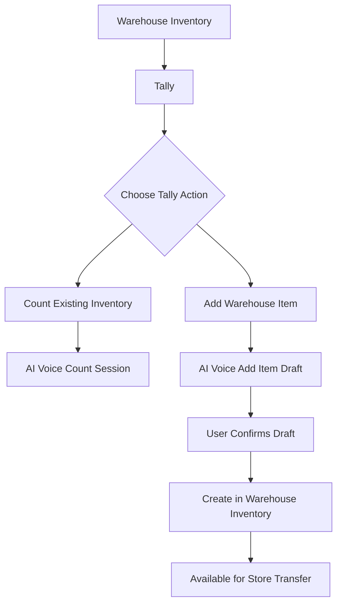

# Tally AI Voice Module Design

Date: 2026-06-07

Status: Proposed design refinement

Audience: Product owner, operations leadership, developers, UAT testers

## Summary

The current warehouse voice entry point is named around "Voice Count." That name is too narrow now because the screen has two related AI voice workflows:

- Tally existing inventory counts.
- Add a new warehouse item by AI voice query.

The recommended name for the module and primary button is **Tally**.

Tally is a better business term because it describes the broader action: using voice to keep inventory records accurate. It can include counting, confirming, adjusting, and creating warehouse inventory records.

## Recommended Navigation

Current concept:

```text
Warehouse Inventory -> Voice Count
```

Recommended concept:

```text
Warehouse Inventory -> Tally
```

The route can remain `/warehouse/voice` for now to avoid a routing migration. The visible label should change first. A future route alias can be added:

```text
/warehouse/tally
```

## Recommended Tally Screen Structure

The Tally screen should have a simple mode-selection layout:



## Primary Actions

### 1. Count Existing Inventory

Purpose:

- Count warehouse items.
- Confirm matching quantities.
- Update mismatched quantities after confirmation.
- Support AI voice query phrases such as:

```text
Coke Zero forty-eight
Red Bull twenty-four
Done
```

Recommended button label:

```text
Start Tally
```

Alternative labels:

- `Tally Inventory`
- `Start Inventory Tally`
- `Voice Tally`

### 2. Add Warehouse Item

Purpose:

- Create a new warehouse inventory item.
- Capture name, category, quantity, minimum, maximum, and optional barcode.
- Require confirmation before saving.
- Keep store locations from creating items directly.

Recommended button label:

```text
Add Item by Voice
```

Alternative labels:

- `Add Warehouse Item`
- `Voice Add Item`
- `Create Warehouse Item`

## Recommended UI Layout

Use one clean Tally landing card with two large action tiles:

| Action | Description | Permission |
| --- | --- | --- |
| Start Tally | Count or update existing warehouse inventory by voice | `use_voice_mode` + `view_warehouse` |
| Add Item by Voice | Create a new warehouse inventory item after spoken confirmation | `edit_warehouse` |

Suggested screen copy:

```text
Tally
Use AI voice to count warehouse inventory or add new warehouse items.
```

Suggested action tile copy:

```text
Start Tally
Speak item names and counts. KeepTally verifies or updates quantities after confirmation.
```

```text
Add Item by Voice
Speak a new item draft. KeepTally creates it in warehouse inventory only after you confirm.
```

## Recommended Behavior

### Tally Existing Items

1. User selects `Start Tally`.
2. User chooses count mode:
   - All items.
   - Low stock.
   - Category.
   - AI free-form.
3. User speaks item count.
4. App transcribes and parses the phrase.
5. App confirms the matched item and quantity.
6. User says `confirm`, `yes`, or another clear affirmation.
7. App verifies or updates the warehouse quantity.

### Add Warehouse Item

1. User selects `Add Item by Voice`.
2. App confirms the warehouse target.
3. User speaks item details.
4. App builds a draft.
5. App reads the draft back.
6. User confirms or cancels.
7. App saves through `POST /api/warehouse`.
8. Item appears in warehouse inventory.
9. Item can later be transferred to store inventory.

## Permission Rules

| Feature | Required permissions |
| --- | --- |
| Open Tally screen | `view_warehouse` |
| Voice count existing items | `use_voice_mode`, `view_warehouse`, and write permission for quantity updates |
| Add item by voice | `edit_warehouse` |
| Store item creation | Not allowed |

Store locations should not expose an add-item voice action. Store inventory should receive items through warehouse transfer only.

## Naming Recommendation

Use **Tally** as the module name.

Use more specific labels inside the module:

- `Start Tally` for counting existing inventory.
- `Add Item by Voice` for creating warehouse inventory.

This keeps the product language clean:

- The module is broad: **Tally**.
- The actions are specific: **Start Tally** and **Add Item by Voice**.

## Improvement Opportunities

1. Add `/warehouse/tally` as a route alias while keeping `/warehouse/voice` for compatibility.
2. Split the setup screen into two clear action tiles instead of mixing add-item and count modes in one vertical list.
3. Add a status strip showing AI readiness, microphone readiness, and current warehouse.
4. Add a visible confirmation card for both count updates and item creation.
5. Add audit events for warehouse add-item attempts, confirmations, cancellations, and save failures.
6. Add a UAT checklist section specifically for Tally.

## Acceptance Criteria

- Navigation label says `Tally`, not `Voice Count`.
- The Tally screen clearly offers two actions: count existing inventory and add warehouse item.
- Store voice screens do not expose item creation.
- Add-item workflow writes only to warehouse inventory.
- Count workflow still verifies and updates existing quantities.
- Users can understand the difference between tallying an existing item and creating a new warehouse item without training.
